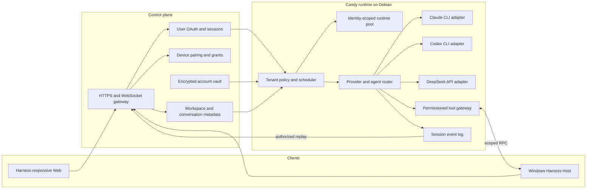

# Agent Note: Multi-tenant CLI agent runtime

Status: proposed

English | [中文](2026-09-02-multi-tenant-cli-agent-runtime.zh.md)

## Problem

Candy needs to serve multiple users through desktop and mobile browsers plus Windows hosts while running coding agents on a Debian server. The inherited Harness supplies an agent loop, plugins, sessions, a responsive Web service, theme and brand plugins, and Windows-local filesystem capabilities, but it does not define tenant identities, isolated provider accounts, remote Windows ownership, or a control-plane contract.

The product must run Claude and Codex through their CLIs and DeepSeek through its API. Reusing a CLI installation or worker infrastructure must never reuse a user's credentials, home directory, process environment, session, workspace grant, or event stream.

## Proposal

Keep the Harness agent loop as Candy's execution core and add tenant-aware services around its existing extension points. Keep authentication, device ownership, durable metadata, encrypted credentials, and policy in the control plane. Run each agent job in an identity-scoped runtime on Debian. Run a Harness Host on Windows and reuse its filesystem, directory-picker, PowerShell, Git, sandbox, Remote, responsive Web, theme, and brand-slot plugins. Candy adds tenant binding and remote routing around those capabilities instead of replacing them.

Desktop and mobile browsers use the same Harness Web service. Candy does not ship a separate mobile application, UI framework, color palette, or theme selector. Product identity uses the existing brand slots, while appearance continues to use the Harness theme plugin.

Claude Agent SDK is outside this design. Claude CLI and Codex CLI are subprocess providers; DeepSeek is an API provider. A provider adapter must emit the same normalized lifecycle events without hiding provider-native diagnostics.

## Target architecture

The control plane is the authority for `userId`, `deviceId`, `accountId`, workspace grants, and session membership. Candy accepts these values only from authenticated control-plane assertions and never from client-selected request fields.

The runtime pool key is `userId + provider + accountId`. Workers may share immutable CLI binaries, package caches, and dispatch infrastructure. Workers must not share credential files, writable home directories, environment overlays, process trees, session stores, or workspace mounts across pool keys.

## Runtime contracts

1. The control plane exchanges a short-lived, audience-bound execution assertion for each run. Candy validates its issuer, audience, expiry, tenant, account, session, device, workspace grant, and nonce before scheduling work.
2. Each CLI invocation receives an isolated home directory, minimal environment, bounded working directory, cancellation handle, output limit, and audit context. Secrets are injected for that invocation and are not written to the shared repository or event log.
3. The provider adapter normalizes start, text, reasoning, tool request, tool result, usage, completion, cancellation, and failure events. It retains a redacted provider-native diagnostic for troubleshooting.
4. Windows operations require an online paired device and a grant that names the workspace and allowed operation class. The companion resolves canonical paths and rejects traversal outside the grant.
5. Session events are append-only and partitioned by tenant. Replay, subscription, export, and deletion authorize against session membership on every request.
6. A child agent inherits a subset of the parent run's account, workspace, tool, token, time, and concurrency grants. Child creation cannot widen any grant.

## Delivery plan

| Task | Outcome | Depends on | Exit evidence |
|---|---|---|---|
| R0 | Fork boundary and threat model | None | Architecture note accepted and abuse cases covered by tests or named follow-up tasks |
| R1 | Tenant, provider-account, credential, and grant model | R0 | Cross-tenant access tests fail closed and credential records are encrypted |
| R2 | DeepSeek API, Claude CLI, and Codex CLI adapters | R1 | Contract suite passes for streaming, cancellation, errors, and usage |
| R3 | Multi-agent orchestration | R2 | Parent-child grants, budgets, cancellation, and audit tests pass |
| R4 | Harness Web and provider-account configuration | R1, R2 | Desktop and mobile browsers use one responsive service and users manage only their own accounts |
| R5 | Tenant binding for Windows Harness Hosts | R1, R3 | Registered-host operations reuse Harness plugins and pass tenant, path, and permission tests |
| R6 | Migration, end-to-end validation, and release | R2, R3, R4, R5 | Staged rollout meets security, recovery, latency, and rollback gates |

### R0 — Boundary and threat model

R0 is delivered as [Candy Runtime Boundaries](../../../../docs/candy-runtime-boundaries.md), which every later task answers to.

- [x] Record the inherited Harness capabilities and the Candy-owned control-plane responsibilities — its *Inherited Harness Capabilities* and *Candy-Owned Control Plane* sections, including the rule that Candy attaches to an existing Harness boundary rather than forking a parallel implementation.
- [x] Model credential theft, tenant confusion, path traversal, event leakage, process escape, replay, and confused-deputy threats — its *Abuse Cases* section carries one paragraph per threat.
- [x] Define trust boundaries for browser, mobile client, control plane, Candy runtime, provider process, and Windows companion — its *Trust Boundaries* section.
- [x] Add architecture-decision and abuse-case review gates to subsequent tasks — its *Review Requirements* section states one per task, R1 through R6, and the delivery table above carries the matching exit evidence. R1's gate is met: cross-tenant reads fail closed and revoked accounts cannot start new work in `dsh-run-admission`'s suite, reads are redacted by `redactCredential`, and every identity claim is proven to sit inside the assertion's MAC rather than only the tenant — a claim moved outside the signature would leave a single-claim test passing while becoming forgeable.

### R1 — Tenant and account foundation

- [x] Define stable identifiers and schemas for user, device, provider account, workspace grant, conversation, session, run, and child run ([`dsh-control-plane`](../../implemented/architecture/2026-09-02-candy-control-plane-identifiers.md)).
- [x] Implement encrypted credential storage with versioned envelopes, key rotation, redacted reads, revocation, and audit events ([`dsh-credential-vault`](../../implemented/architecture/2026-09-02-candy-credential-vault.md)). The accounts and their sealed credentials are now durable ([ports with nothing behind them](../../implemented/architecture/2026-09-04-ports-with-nothing-behind-them.md)): `dsh-control-plane-store` holds them and each tenant's allowance in one `storage-domain` domain over SQLite, so two of admission's three ports have implementations and a restart keeps what a tenant configured. Audit records are still only returned, and the store that persists them remains unbuilt. Rotation is now expressible ([a rotation that locked every tenant out](../../implemented/architecture/2026-09-06-a-rotation-that-locked-every-tenant-out.md)): the vault takes a keyring of retained versions, and the scheduler built one holding a single key, so changing the version refused every tenant's every run with `unknown-key` until the old value was restored. `retiredCredentialKeys` names the versions a runtime still opens; driving the rewrap pass that lets a retired key finally go is the operator's. A revocation now also stops work already under way ([a revocation that only stopped the next run](../../implemented/architecture/2026-09-05-a-revocation-that-only-stopped-the-next-run.md)): destroying the envelope stops the next admission but reaches nothing already holding an opened credential, so a live run kept billing its tenant after its account was revoked. The metering listener reads the account record on every call and refuses with `CREDENTIAL_REVOKED` before the provider is reached. The run is ended too, at the next sweep ([a run refused but not ended](../../implemented/architecture/2026-09-06-a-run-refused-but-not-ended.md)): refusing its calls left it open for the rest of its lease, holding its funder's allowance with what it had already spent unbilled — a run existing only to be refused. Revocation did not need to reach the runtime as an event after all, because the sweep already polls; a run whose account can no longer authorize it is settled there, on the same judgement `meterRequest` makes, and one whose record the store cannot answer for is left to its lease. Terminating the provider process such a run left behind now has a place to reach it ([a run that settled but kept running](../../implemented/architecture/2026-09-06-a-run-that-settled-but-kept-running.md)): `RunScheduler.registerDisposer` holds one disposer per run, invoked before the settlement writes when that run or a descendant closes, and `disposableSpawn` gets a provider binding this by composing it around the `spawn` function it already hands its adapter. A binding calls it now ([the adapter that could not be shared](../../implemented/architecture/2026-09-06-the-adapter-that-could-not-be-shared.md)): `dsh-claude-cli-route` composes `disposableSpawn` around the `spawn` it hands `ClaudeCliAdapter`, so ending a run for cause reaches the process that run's own call started.
- [x] Implement short-lived execution assertions and reject client-supplied tenant or account overrides ([`dsh-execution-assertion`](../../implemented/architecture/2026-09-02-candy-execution-assertions.md)) — and the replay store the nonce implies is built ([one step decides a nonce](../../implemented/architecture/2026-09-03-one-step-decides-a-nonce.md)): `admitRun` requires a `spendNonce` port and never retries a spent nonce, so that port is the whole of the protection, and the implementation it invites — look the nonce up, then insert it — admits both copies of a replayed token. `RunReplayStore` decides in one synchronous step, holds a record exactly while its assertion stays admissible, and keys by tenant so one tenant cannot deny another's run by spending a value first. It serves one process; a deployment running more than one needs a durable store, which now has a written contract rather than an inferred one. The token's version prefix now means what it says ([a version prefix that signed nothing](../../implemented/architecture/2026-09-05-a-version-prefix-that-signed-nothing.md)): the MAC covered the payload alone, so the prefix promising that a future claim set mints `v2` rather than reinterpreting `v1` was unauthenticated text in front of a signed blob. It is inside the MAC now, which costs a format change while the only claim set is `v1`.
- [x] Partition runtime homes, process ownership, event logs, caches with private content, quotas, and cleanup by pool key ([`dsh-runtime-pool`](../../implemented/architecture/2026-09-02-candy-runtime-pool-partitioning.md)); the key and each pool's root are derived, and a Claude CLI run is now placed in its pool by construction — [`dsh-claude-cli-binding`](../../implemented/architecture/2026-09-03-admitted-run-to-claude-cli-launch.md) reads the process's home, working directory, credential and spend ceiling out of the admitted run, so no caller pairs one tenant's directory with another's key. Creating the directory is now owned too: `openRuntimePool` makes a pool root private with an applied mode rather than a requested one and refuses to invent a pool base the deployment never provisioned ([a pool root is made private](../../implemented/architecture/2026-09-03-a-pool-root-is-made-private.md)) — the `mkdir` every caller had hand-rolled leaves an already-existing root at whatever permissions it had, and that root is where the tenant's credential is written. The pool root is now also the only place the CLI is told to keep state ([a home that nothing had to obey](../../implemented/architecture/2026-09-05-a-home-that-nothing-had-to-obey.md)): the child's `HOME` was the tenant's while an ambient `CLAUDE_CONFIG_DIR` or XDG base directory — neither credential-shaped nor a routing toggle, so scrubbed by nothing — named a directory outside it, giving every tenant one configuration and account-state directory to share. `SCRUBBED_STATE_VARIABLES` tombstones them, so the isolation rests on the pool root rather than on the deployment's environment hygiene. Enforcing quotas and cleanup stay with the unbuilt pool runtime, as do the pool base's own permissions. The credential that pool holds no longer leaves by a stream nothing watched ([the stream redaction could not reach](../../implemented/architecture/2026-09-05-the-stream-redaction-could-not-reach.md)): the CLI's stderr was inherited, so a diagnostic quoting the rejected key wrote it to the host's own console while the identical text on stdout was redacted. It is collected and bounded now, and its tail reaches a dead run's failure through the redaction every chunk already passes. The steps now compose in one place ([the order had no owner](../../implemented/architecture/2026-09-04-the-order-had-no-owner.md)): `startRun` admits, funds and places one run, and closes the ledger record it opened when the placement refuses, so a failed placement does not leave a parent short until the lease expires. It is not a scheduler — which run starts, and whether a tenant may start another, are still decisions nothing makes.

### R2 — Provider adapters

Adapters implement the inherited `dsh-llm` seam rather than a Candy-owned one. `LlmAdapter` is the provider base, `StreamChunk` already carries block start, text, reasoning, tool-call deltas, usage, and one terminal finish, and `dsh-llm/invariant` enforces that grammar around every provider stream. Candy adds providers to that seam and does not define a second lifecycle vocabulary.

- [x] Implement the DeepSeek API adapter with streaming, tool calls, usage, retry classification, cancellation, and redacted errors — inherited as `dsh-llm-deepseek` (`DeepSeekAdapter`), with `dsh-llm-pi-ai` a second implementation of the same seam.
- [x] Implement the Claude CLI adapter with isolated home, non-interactive input, structured output parsing, cancellation, and process-tree cleanup ([`dsh-claude-cli-protocol`](../../implemented/architecture/2026-09-03-claude-cli-stream-protocol.md) and [`dsh-llm-claude-cli`](../../implemented/architecture/2026-09-03-claude-cli-llm-adapter.md)). Candy parses `--output-format stream-json` directly rather than reusing the Agent SDK path `dsh-subagent-claude-code` takes, because that SDK supplies an agent loop where this seam needs a model call. The route is narrow by decision, not by omission: it serves one-shot text calls and refuses a conversation, tool schemas, and every generation control the CLI has no flag for, each by name. Its output is bounded and redacted too ([a piped stream is the caller's to bound](../../implemented/architecture/2026-09-04-a-piped-stream-is-the-callers-to-bound.md), [a provider quoting its key back](../../implemented/architecture/2026-09-04-a-provider-quoting-its-key-back.md)): the seam hands a `'pipe'` stream to its decoder, so nothing but this route could bound it, and the boundaries page asks for provider output to reach a caller through a bounded, redacted adapter. The contract suite's redaction assertion had been passing because the recorded fixture holds no key, not because anything removed one. The agent loop therefore cannot use it yet — closing that needs the multi-turn and tool decisions the adapter note records as open, and remains open: a recorded run settled what the CLI's own input does rather than inventing a transcript format ([a conversation stdin could not carry](../../implemented/architecture/2026-09-06-a-conversation-stdin-could-not-carry.md)). What multi-tenancy needed regardless of that decision is separately built now ([the adapter that could not be shared](../../implemented/architecture/2026-09-06-the-adapter-that-could-not-be-shared.md)): [`dsh-claude-cli-route`](../../../../packages/control-plane/claude-cli-route) mounts one route whose credential and pool are resolved per call from the run driving the request's session, so a multi-tenant runtime no longer needs to construct and dispose a `ClaudeCliAdapter` per pool by hand to serve even the one-shot calls this route already can (`dsh-compaction`, `dsh-session-title`) — no deployment mounts it yet, and a multi-turn-capable route still needs the decision above before the loop itself could.
- [ ] Implement the Codex CLI adapter with the same isolation and lifecycle guarantees. Blocked on recording real output, not on design. What `codex` 0.153.0 was observed to do: `codex exec --json` writes JSONL to stdout; the prompt is a positional argument, and stdin must be closed or the command waits on it; isolation is `CODEX_HOME` plus `--ephemeral`, `--ignore-user-config`, `-s read-only`, `-C <dir>` and `--skip-git-repo-check`; there is no system-prompt flag and no flag accepting caller tool schemas. Observed frames were `{"type":"thread.started","thread_id"}`, `{"type":"turn.started"}`, `{"type":"error","message"}`, and `{"type":"item.completed","item":{"id","type","message"}}` — a thread/turn/item model, unlike the Claude CLI's Messages-API events. The content, completion and usage frames were never reached: this environment's egress policy denies `api.openai.com`, so no run gets past connection, and `developers.openai.com` is blocked too, while the npm package ships only a launcher with no schema. Writing the translator from the frame names alone would be the guess the Claude CLI work avoided, where three behaviors contradicted the reasonable assumption. It needs one recorded run from a host with egress and a key.
- [x] Build one provider contract suite with success, malformed output, timeout, quota, cancellation, crash, and secret-leak fixtures ([`dsh-llm-adapter-contract`](../../implemented/architecture/2026-09-03-llm-adapter-conformance.md)). It runs at the seam, because the one-terminal-chunk guarantee belongs to `LlmRuntime` rather than to an adapter, and every adapter on the seam runs it — `dsh-llm-deepseek`, `dsh-llm-pi-ai`, and `dsh-llm-claude-cli`. Running it found and fixed a real process leak: a consumer that stopped reading left the CLI running. Timeout, quota and crash collapse into one failed-run case, since the suite asserts what an adapter owes a failure rather than how it was caused; malformed output stays with each adapter's own wire parser.

### R3 — Multi-agent orchestration

- [ ] Add an agent registry and routing policy for explicit selection, capability matching, and permitted fallback. The registry half is inherited: [`dsh-agent-presets`](../../../../packages/preset/agent-presets) already lists every composed agent preset a deployment or user configured, reports a reason when one cannot start a session, and lets a session select one explicitly, while [`dsh-subagent`](../../../../packages/subagent/subagent)'s `tool-subagent` already carries a `ModelSelectionPolicy` allowlist and resolves an explicit provider/model override through the live LLM registry before delegating a child. Capability matching and fallback do not yet have a real second option to match or fall back to: [`dsh-llm-claude-cli`](../../../../packages/llm/llm-claude-cli) refuses a conversation, tool schemas, and non-text content by name, so it cannot serve the main agent loop today, and Codex CLI has no adapter — a routing policy built now would compare one usable route against itself, which is not a policy a test can distinguish from doing nothing. Of what is genuinely Candy's to add, the preset-roster half is now built: [`dsh-agent-presets`](../../../../packages/preset/agent-presets) gained a generic `guard()` extension point consulted by both `mount()` and `recompose()`, and [`dsh-tenant-preset-policy`](../../../../packages/control-plane/tenant-preset-policy) resolves a session's tenant through `RunScheduler.tenantOf` (synchronous, reading the same run index metering already reads) to enforce a per-tenant allowlist against it ([a roster with no notion of a tenant](../../implemented/architecture/2026-09-06-a-roster-with-no-notion-of-a-tenant.md)). A route allowlist restricting which provider a tenant may call is not: `ModelSelectionPolicy` today governs subagent delegation, resolved from Settings, not a tenant identity the scheduler owns, and no route-level guard equivalent to the preset one exists yet.
- [ ] Add parent-child run records with parent-subset grants, depth, concurrency, token, time, and cost budgets. Depth and sandbox grants are inherited, not Candy's to build: `dsh-subagent` already refuses a child past `maxDepth` and pins a delegated child's sandbox mode and approval policy to its parent's. The account grant is Candy's, and nothing enforced it ([a child that brought its own tenant](../../implemented/architecture/2026-09-05-a-child-that-brought-its-own-tenant.md)): a child naming a different tenant and account started, opened that tenant's credential, and had its spend billed to the parent's tenant while its own was billed nothing — the ledger funds a child from its parent and the vault opens whichever credential the claims name, and nothing compared the two. `admitRun` now refuses a child whose tenant or account differs from its parent's, before the budget and before the nonce. The workspace grant is checked now too ([a grant nobody could resolve](../../implemented/architecture/2026-09-07-a-grant-nobody-could-resolve.md)): `WorkspaceGrantId` was a branded string with no reader anywhere — `dsh-run-admission` never mentioned it — so a run named whatever grant it liked and no step looked, which left the widest of the three inherited grants, the one deciding which files a process can reach, entirely unenforced. `dsh-workspace-grant` makes it a durable record (tenant, device, granted roots, a `SandboxMode` ceiling, revision, revocation) and admission resolves it before spending the nonce, refusing an id nothing resolves, a revoked grant, another tenant's or another device's, and a child naming any grant but its parent's. Equality is the subset rule at its strongest — over-granting is impossible rather than detectable — and nothing issues a narrowed child grant today. Path containment is deliberately not decided there: a grant's roots are spelled for the issuing device, and resolving a path against them is that device's filesystem semantics, so the roots travel on the admitted run for the check that belongs where the file operation happens. That second check, and the link-escape and junction cases that are its acceptance criteria, are not built. The budget half is built ([`dsh-run-budget`](../../implemented/architecture/2026-09-03-run-budget-delegation.md)): a child's tokens, wall time, money and concurrency are subtracted from its parent at reservation, so over-delegation is impossible rather than detectable, and the unspent remainder returns at settlement. Concurrency is conserved across the whole tree rather than one level of it ([concurrency is conserved across a tree](../../implemented/architecture/2026-09-04-concurrency-is-conserved-across-a-tree.md)): a child costs its parent the slot it occupies plus every slot it may hand down, because charging one slot per child let a grant of four seed 1364 live runs at depth five, which is not the parent-subset rule the boundaries page states. An exhausted run is already refused at the gate: `admitRun` reads the allowance a run is started against through a required `findBudget` port and denies before it spends the nonce or opens a credential ([the budget nothing consulted](../../implemented/architecture/2026-09-03-admission-enforces-the-budget.md)). For a child run that allowance is its parent's remainder, read from the ledger, so an exhausted parent stops a child while its assertion is still valid rather than after its nonce is gone. Money is measured on the one route that reports it: the Claude CLI's `total_cost_usd` now reaches `TokenUsage.costMicroUsd` ([the bill the provider already sent](../../implemented/architecture/2026-09-03-provider-reported-cost.md)), so a tenant's spend is a recorded fact rather than a price table a caller maintains. The run record is built ([`dsh-run-ledger`](../../implemented/architecture/2026-09-03-run-ledger-settles-exactly.md)): it holds what each open run was given and has left, closes a subtree with its root, and releases an abandoned hold on a lease — exactly rather than by estimate, since every charge went through it. The clock now runs ([the clock nobody wound](../../implemented/architecture/2026-09-04-the-clock-nobody-wound.md)): `dsh-run-scheduler` owns one runtime's ledger and replay store, composes the admission policy from the durable store, and sweeps expired holds and dead nonce records on its own interval — `expire` was a call nothing made, so an abandoned run held its parent's allowance for as long as that parent lived. That clock then ran over working runs, because the other half of the lease was missing too ([a lease that only counted down](../../implemented/architecture/2026-09-06-a-lease-that-only-counted-down.md)): `RunLedger.renew` had no caller outside its own unit test, so no lease ever advanced and every run was settled `leaseMs` after it opened however hard its agent was working — its session then refused for the rest of its life. The sweep now renews instead of settling when this runtime still holds the run's session, which is the question a lease only approximates; a revoked account still ends its run regardless, and a composition with no session store is left to its lease exactly as before. A tenant's allowance is now consumed rather than re-read ([a grant that funded every run](../../implemented/architecture/2026-09-04-a-grant-that-funded-every-run.md)): `dsh-tenant-allowance` holds a grant beside what its settled runs took from it, `remainingAllowance` also subtracts the reservation of every run of that tenant still open, and the scheduler charges a tree to its tenant when the tree's root closes. Before it, the store returned the same grant to every run, so a tenant granted a million tokens started every run against the same million and two live runs could spend it twice; `grant.children` now bounds the tenant's whole forest, which is the tenant-wide concurrency cap the scheduler had declined to invent. The budget also stops work now, not only records it ([a budget that only took notes](../../implemented/architecture/2026-09-05-a-budget-that-only-took-notes.md)): `charge` reported the dimensions a run had used in full and nothing read that report, so a run admitted with a thousand tokens could stream a million. `dsh-run-metering` wraps one provider stream for one open run — refusing the call before the provider is reached when the run has nothing left, cutting one that outruns the wall time the run still had, and charging what it consumed before the terminal chunk reaches the consumer, so an agent loop cannot make one call too many. `RunScheduler.meter` binds it to the durable charge, and the meter is wired to the loop ([the session was the join](../../implemented/architecture/2026-09-05-the-session-was-the-join.md)): a run's durable record names the session its assertion gave it, every assembled request already carries the session it was assembled for, and one `llm/stream` listener meters a request against the run whose session it names — so an agent driven on a run's session is bounded without a `runId` on `GenerateOptions`, which would make the inherited seam carry a concept only Candy has. Those bounds hold under concurrency now ([a check and the hold it authorizes](../../implemented/architecture/2026-09-05-a-check-and-the-hold-it-authorizes.md)): the tenant remainder, the parent's allowance and the session's holder were each read during admission and consumed a few awaits later, so two concurrent starts for one tenant both opened against the whole remainder and the ledger held twice the grant. The scheduler's chain now orders whole operations rather than writes, at the cost of serializing starts across tenants. A delegated child had no way to become a run at all until now: nothing in this codebase's production path has ever minted an execution assertion — every call site outside its own package is a test constructing one by hand — so a subagent's fresh session resolved no run and a route like `dsh-claude-cli-route` refused it outright ([no one mints an assertion](../../implemented/architecture/2026-09-06-no-one-mints-an-assertion.md)). `RunScheduler.startChildRun` mints one for exactly the case that needs no new authentication — a delegated child's identity is its parent's, already verified — copying the parent's tenant, account, provider, device, workspace grant and conversation from fields `DurableRunRecord` now retains, and driving the mint through the same `start()` a caller-supplied token would, so the parent-subset budget and concurrency accounting above apply unchanged. `dsh-subagent` now calls it: `SubagentRuntime` gained `onBeforeDelegate()`/`prepareDelegatedChild()`, the same kind of Candy-agnostic extension point `dsh-agent-presets`' `guard()` gave the preset roster, run from the in-process one-shot driver before `ctx.agents.create()` so an asynchronous mint completes before the child could make its first request ([a driver with no notion of a run](../../implemented/architecture/2026-09-06-a-driver-with-no-notion-of-a-run.md)). `dsh-run-delegation` is the new Candy-owned consumer: it mints and opens a child's run from a configured fixed `childBudget`, and refuses the delegation outright — before any child exists — when the parent's session resolves to no single usable run or the mint cannot be funded. Continuable children and out-of-process product providers are not yet wired to this hook, and the general assertion-issuing authority (real user authentication and device pairing) the architecture diagram names still has no task in this table that builds it.

That mapping is kept unique where it is created ([one session, one run](../../implemented/architecture/2026-09-05-one-session-one-run.md)): `admitRun` gains a `findSessionRun` port and refuses a run whose session another run already drives, after the budget and before the nonce so the refusal can be retried. Nothing had checked, so two tenants' runs could both open on one session and only the metering lookup noticed — one call at a time, with the tenant minted onto another's session stopping that tenant's work rather than being stopped. A session two records still claim is refused at the call too, because `start` is not the only writer of a run record. A settled run's session stays refused rather than falling back to unmetered ([a run that ended and kept spending](../../implemented/architecture/2026-09-05-a-run-that-ended-and-kept-spending.md)): a lease can expire under a working agent, and with the record deleted its next call looked like one this runtime never had — the run cut off for outliving its lease then ran for free. A stalled provider is bounded by the run's own wall time now ([the provider that said nothing](../../implemented/architecture/2026-09-05-the-provider-that-said-nothing.md)): the deadline was checked between chunks, so a provider that accepted a request and went quiet produced nothing to check against and ran twenty times its allowance in a probe. Each read races the time the run has left. A run's own calls no longer outspend it either ([two calls that read one remainder](../../implemented/architecture/2026-09-05-two-calls-that-read-one-remainder.md)): two overlapping calls each started against a remainder neither had been charged against, so a run funded for one call spent two, and `meter` now holds a run's calls in a line — per run, so tenants never wait for each other. Work with no session of its own — a launched provider process, a tool that calls out — is still unattributed, which is what the launch-audit record is waiting for.

Durability is closed too ([a settlement that a crash could lose](../../implemented/architecture/2026-09-04-a-settlement-that-a-crash-could-lose.md)): the store keeps one record per live run, the charge is computed with `RunLedger.settlementOf`, written down and applied before the hold is released, and each funder records the id of the settlement it last absorbed — so a rejected write leaves the run open for the next sweep, and a restart re-drives an interrupted settlement exactly once rather than charging it twice. A restart now settles what it was driving and charges each tenant what its runs consumed, where it used to hand the whole unconsumed allowance back. One shape of corruption is repaired at boot now ([one damaged record took every tenant down](../../implemented/architecture/2026-09-06-one-damaged-record-took-every-tenant-down.md)): a record naming a parent the store does not hold failed the plugin and with it the whole runtime, so one damaged record stopped every tenant. It is adopted as a root, cleared in the store and settled against its own tenant, which loses no accounting because recovery settles every root it restores anyway. What is left in this bullet is corruption of other shapes — a record that fails its schema, a tenant allowance that is gone — which still fails the boot with no repair path, and the fact that every run-record write in a runtime is serialized.
- [ ] Propagate cancellation through children, provider processes, tools, and event streams, then verify complete process cleanup. The provider-process half is verified: cancelling or abandoning a bound Claude CLI run reaps both the CLI and a process it started, checked against real pids in [`dsh-claude-cli-binding`](../../implemented/architecture/2026-09-03-admitted-run-to-claude-cli-launch.md) rather than against a scripted handle.  What a cancelled call does to the run that made it is verified now ([a line a failed close could hold](../../implemented/architecture/2026-09-06-a-line-a-failed-close-could-hold.md)): cancelling mid-stream ends the stream, closes the provider source, charges the run for what the call consumed before the caller gave up, leaves the run open, and lets its next call proceed — all pinned. Giving up the run's place in its call line then moved into a `finally`, because a provider whose teardown throws rejects out of that close and would otherwise strand the run for the rest of its life. One half of the child question is verified now: a delegated child's run is released on every path that ends its epoch — settlement, and, through the pre-publication rollback `onBeforeDelegate` hooks now return, a cancelled signal or a failed creation that never publishes a child at all. Without that rollback a delegation cancelled between funding and creation stranded the child's run, since no `subagent/end` names a child that was never created ([a driver with no notion of a run](../../implemented/architecture/2026-09-06-a-driver-with-no-notion-of-a-run.md)). A cancelled parent reaches a child that is already running through the driver's own abort bridge, and the epoch it ends is the one holding the run, so that release is the same one settlement takes — pinned against a child left mid-turn by a `hang` script. Tools and event streams through a Candy run remain unverified.
- [ ] Record routing, delegation, tool authorization, usage, and terminal state in a tenant-scoped audit trail. Started at the one place records already existed and were being lost: `admitRun` returned the vault's audit only on success and discarded the record `openCredential` produces on its failing branch, losing the cross-tenant access attempts the vault had detected. Every admission outcome now carries `audits` ([a denied run is the event the audit trail is for](../../implemented/architecture/2026-09-03-run-admission-audits-every-outcome.md)), and every denial past the assertion now names the tenant, account and run it refused ([a denial that names nobody is not a record](../../implemented/architecture/2026-09-03-a-denial-names-who.md)) — a replayed nonce is the clearest attack signal admission can observe, and it was being reported without an identity a caller could log. The records now have a home ([an audit trail with no reader](../../implemented/architecture/2026-09-05-an-audit-trail-with-no-reader.md)): `ControlPlaneStore` keeps a bounded trail per subject, `RunScheduler` files everything one scheduling attempt produced, and `auditsOfTenant` / `auditsOfRuntime` read them back across a restart. A token that fails to verify names no tenant this runtime may believe, so its record is filed against the runtime rather than dropped, and `dsh-run-start`'s ledger refusal now carries the claims it had been discarding. Concurrent attempts all reach the trail ([the read that was not in the queue](../../implemented/architecture/2026-09-05-the-read-that-was-not-in-the-queue.md)): `storage-domain` queues each write but not the read that decides what to write, so appending by read-then-put dropped every concurrent append — thirty-two at once kept one — and the same shape lost a tenant's concurrent charges. Every read-modify-write in the store now queues on one chain. Refused calls now reach it too ([the refusals nobody recorded](../../implemented/architecture/2026-09-05-the-refusals-nobody-recorded.md)): admission files every scheduling attempt and saw none of what is decided per call, so a revoked account still spending, a run that had used up its allowance, and a session no open run claims all happened where nothing was written. `dsh-run-metering` gained an optional `refused` port beside its optional `now`, the scheduler files what it refuses itself, and the record is durable before the caller is told — an operator reading the trail is never behind a consumer already acting on the refusal. Delegation and terminal state have since been added ([a trail that only said a run began](../../implemented/architecture/2026-09-07-a-trail-that-only-said-a-run-began.md)): a completed delegation left a `started` record per run and nothing said the second was the first one's child, nor that either had ended — the lineage lives on a durable run record that settlement deletes, and settlement wrote no record at all, so a delegating agent's tree read back as unrelated overlapping runs and every finished run was indistinguishable from one still working. `RunAuditRecord` now carries `parentRunId` on every record about a run, and `event: 'settled'` names how one ended: `closed`, `expired`, `revoked` or `recovered`, taken from the caller that settled it rather than guessed where the record is written. The durable declaration moved to version 5 for it. What a run cost is still not in the trail — `settledSpent` is folded into the funder and the terminal record names only the cause — and routing, tool authorization and usage still need orchestration this release has not built. A trail is a window rather than an archive: what falls past `auditRetention` is gone, and a terminal record per settlement fills it about twice as fast. Repetition can no longer erase what precedes it ([a trail its own subject could erase](../../implemented/architecture/2026-09-06-a-trail-its-own-subject-could-erase.md)): eight refused calls against a retention of four left only refusals, so the records an operator investigates a revoked credential with were displaced by the attack itself; a record identical to the newest in every field but its instant now folds into it as a count. A durable replay store for more than one runtime process stays blocked on the storage seam rather than unbuilt: an indivisible single-use nonce needs a write that fails on an existing key, and `dsh-storage` offers an unconditional upsert with reads answered from the snapshot loaded at open.

The boundaries page also asks for an audit record per launched provider or tool process, and that one is not a Candy gap to patch locally. A vault record is written once per admitted run, while a run launches a process per invocation — `dsh-claude-cli-binding`'s accounting cases run two under one admission — so the two are not one-to-one even for credential access. The producer exists now ([every spawner reports through one seam](../../implemented/architecture/2026-09-06-every-spawner-reports-through-one-seam.md)): `dsh-subprocess` emits `subprocess/launched` from `spawn` and `spawnTerminal` themselves, delegating to `spawnProcess` and `spawnTerminalSession` that implementations override, so a spawner cannot start a child without announcing it. The record names the executable, directory, pid and kind, and never the arguments or environment — a spawner's argv carries whatever its caller put there. A launch started during a metered call now reaches the trail attributed ([a scope a stream could not carry](../../implemented/architecture/2026-09-06-a-scope-a-stream-could-not-carry.md)): the scheduler enters a run scope around each pull of a metered stream, and its `subprocess/launched` listener files the launch against that run's tenant under `event: 'launched'`. The scope is per pull because an async generator's body runs in its consumer's context, not the one it was created in — a scope around the stream attributes nothing, which the negative control shows as zero records. A launch outside any metered call stays unattributed and unfiled, since it belongs to no tenant and would displace records in a trail bounded per subject.

Persistent replay is no longer blocked by that storage seam ([a nonce that survives the process](../../implemented/architecture/2026-09-07-a-nonce-that-survives-the-process.md)). `dsh-storage` now exposes optional compare/exchange, SQLite implements it transactionally, and `ControlPlaneStore` owns expiry-bounded nonce records shared by restarts and multiple runtime processes. JSON fails closed because it cannot make the same guarantee.

The route-authorization half of R3 is now implemented in [`dsh-tenant-route-policy`](../../../../packages/control-plane/tenant-route-policy) ([the route at the last door](../../implemented/architecture/2026-09-07-the-route-at-the-last-door.md)). It resolves the live tenant before adapter preparation and again at final dispatch, then requires an exact provider/model pair with a closed default for managed tenants. Its denials are durable tenant audit records before they reach the caller. This deliberately does not mark the whole routing item complete: capability matching and an account-authorized second-route fallback still need two real interchangeable routes, while durable route-policy configuration remains follow-up work.

### R4 — Harness Web and account configuration

- [x] Add provider-account list, create, validate, select-default, revoke, and delete APIs with ownership checks ([`dsh-provider-accounts`](../../implemented/architecture/2026-09-03-provider-account-management.md)); the Web controller and provider-specific validation probes remain. One default per tenant and provider is an invariant now rather than an intention ([two accounts marked default](../../implemented/architecture/2026-09-06-two-accounts-marked-default.md)): revoking or deleting an account promoted a replacement unconditionally, so removing a non-default one left two accounts marked default and whoever resolved the default got an arbitrary one of them.
- [ ] Extend the existing Harness Web settings for DeepSeek API keys and server-side Claude CLI and Codex CLI login states; verify the same routes at desktop and mobile viewport sizes.
- [ ] Reuse the Harness theme and brand-slot plugins; remove any Candy-specific palette, theme selector, duplicated layout, or separate mobile surface.
- [x] Expose safe diagnostics without returning tokens, credential paths, raw environment values, or another tenant's metadata ([the first thing an operator logs](../../implemented/architecture/2026-09-06-the-first-thing-an-operator-logs.md)). Every reader this runtime has — a tenant's trail, the runtime trail, a denied outcome, a ledger record — came back clean of secrets, keys, pool paths and other tenants, and is pinned that way. The surface that was not clean is the one an operator reaches for first: `JSON.stringify` of a successful start outcome carried the tenant's decrypted provider key byte by byte, because `AdmittedRun.secret` was an ordinary property. It is non-enumerable now, with a `toJSON` that redacts it — both, because `JSON.stringify` uses `toJSON` while `console.log` and `util.inspect` walk own properties and ignore it. What remains for this bullet is the Web surface itself: these are library readers, and a controller that exposes them over HTTP has its own authorization to get right.

### R5 — Windows Harness Host tenant binding

- [ ] Register each Windows Harness Host to one user and device, then bind its existing Remote capabilities to short-lived Candy assertions. The Remote layer exists (`dsh-api-gateway` carries typed calls, `dsh-api-remotes` decides what is exposed), but a *registered host* does not: `host/` is the local web-GUI half — HTTP server, SPA server, directory picker, plugin inventory — with no notion of a machine addressed by a server URL, and the harness's only identity is `dsh-anonymous-user-id`, a per-installation UUID designed not to identify a user. This bullet therefore builds the remote-host concept before it can bind anything to it, and it needs R1's control plane running as a service rather than as the libraries this release shipped.
- [ ] Reuse `fs-local`, directory-picker, PowerShell, Windows ACL sandbox, and API Gateway plugins behind explicit workspace roots and operation-class grants. All five exist: [`dsh-fs-local`](../../../../packages/fs/fs-local), [`dsh-directory-picker`](../../../../packages/host/directory-picker) with native, browse and adaptive backends, [`dsh-pwsh-local`](../../../../packages/shell/pwsh-local) with its sandbox and persistent tools, [`dsh-sandbox-windows-acl`](../../../../packages/sandbox/sandbox-windows-acl), and [`dsh-api-gateway`](../../../../packages/api/gateway). The ACL sandbox is the hardest piece and is already real — a restricted token confines writes to the workspace and a private temp directory, every Win32 call is checked so a child is never spawned unrestricted, and it reports `partial` because the token must retain Everyone to initialize and NTFS hard links alias one file object across paths. There is no Git plugin to reuse: the repository has only `dsh-webhook-github`, an unrelated webhook ingress, so Git reaches a workspace through the bash and pwsh tools like any other command.
- [ ] Add server URL, pairing, connectivity, revocation, offline detection, reconnect, idempotency, bounded output, and approval state without defining a second file-operation protocol.
- [ ] Test tenant routing, Unicode and long paths, branch discovery, concurrent edits, device revocation, reconnect, junction or symlink escape, and malicious path inputs on Windows.

### R6 — Migration and release

- [ ] Add configuration and metadata migrations from ClauGod concepts to Candy without importing Claude SDK credentials or sessions.
- [ ] Run end-to-end scenarios for each provider, multiple tenants, multiple accounts, child agents, Windows workspaces, and reconnect replay.
- [ ] Deploy behind feature flags with per-provider canaries, resource dashboards, security alerts, backups, and a tested rollback procedure.
- [ ] Remove obsolete Claude SDK paths only after migration verification and publish operator and user recovery guidance.

## Alternatives considered

**Continue building a custom agent loop.** This retains complete control but duplicates the Harness plugin, session, tool, and event foundations. The team would spend more time rebuilding infrastructure before improving tenant isolation and provider support.

**Use Claude Agent SDK as the server runtime.** This makes Claude the architectural center and weakens parity with Codex CLI and DeepSeek. It also conflicts with the requirement to standardize Claude and Codex as CLI subprocess providers.

**Share one authenticated CLI home between users.** This reduces login friction but makes credential attribution, revocation, audit, and data isolation unreliable. Candy permits shared immutable installations, not shared authenticated state.

**Build a separate mobile client and Candy color system.** This duplicates the responsive Harness Web surface and its theme registry, increases visual drift, and creates two client release paths. Candy instead composes the existing Web, theme, and brand-slot plugins.

## Acceptance criteria

1. Two concurrent tenants can use the same provider and repository name without sharing credentials, writable homes, processes, session events, workspace grants, or cached private content.
2. Claude CLI, Codex CLI, and DeepSeek API pass one lifecycle contract suite, including cancellation and provider failure.
3. A child agent cannot exceed its parent's account, workspace, tool, token, time, or concurrency grants.
4. A revoked account, device, or workspace grant blocks new work immediately and prevents unauthorized replay or reconnect.
5. Windows operations cannot escape an explicitly granted canonical workspace root and remain attributable to one user, device, session, and run.
6. Desktop and mobile browsers use the same responsive Harness Web routes and can reconnect and replay authorized session state without direct access to provider credentials.
7. Operators can detect, contain, and audit cross-tenant attempts, orphaned processes, quota violations, and provider outages without reading user secrets.

## Risks

CLI output and authentication formats can change without stable machine contracts. Adapters need version probes, strict parsers, compatibility fixtures, and fail-closed behavior.

Subprocess isolation is weaker than a complete host boundary if all workers share one operating-system identity. Production deployment may require per-tenant operating-system users or stronger sandboxing after measurement and threat review.

Windows RPC expands the attack surface to local files and command execution. Narrow grants, local confirmation for sensitive classes, canonical path checks, signed messages, and revocation are release blockers.

The control plane and Candy can drift on identity or authorization semantics. A versioned assertion schema, compatibility window, contract tests, and coordinated rollout must keep both sides aligned.
