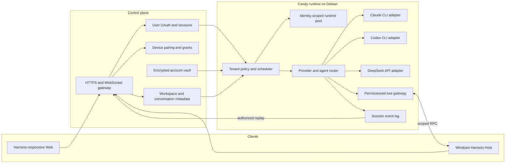

# Agent Note: Multi-tenant CLI agent runtime

Status: proposed

English | [中文](2026-09-02-multi-tenant-cli-agent-runtime.zh.md)

## Problem

Candy needs to serve multiple users through desktop and mobile browsers plus Windows hosts while running coding agents on a Debian server. The inherited Harness supplies an agent loop, plugins, sessions, a responsive Web service, theme and brand plugins, and Windows-local filesystem capabilities, but it does not define tenant identities, isolated provider accounts, remote Windows ownership, or a control-plane contract.

The product must run Claude and Codex through their CLIs and DeepSeek through its API. Reusing a CLI installation or worker infrastructure must never reuse a user's credentials, home directory, process environment, session, workspace grant, or event stream.

## Proposal

Keep the Harness agent loop as Candy's execution core and add tenant-aware services around its existing extension points. Keep authentication, device ownership, durable metadata, encrypted credentials, and policy in the control plane. Run each agent job in an identity-scoped runtime on Debian. Run a Harness Host on Windows and reuse its filesystem, directory-picker, PowerShell, Git, sandbox, Remote, responsive Web, theme, and brand-slot plugins. Candy adds tenant binding and remote routing around those capabilities instead of replacing them.

Desktop and mobile browsers use the same Harness Web service. Candy does not ship a separate mobile application, UI framework, color palette, or theme selector. Product identity uses the existing brand slots, while appearance continues to use the Harness theme plugin.

Claude Agent SDK is outside this design. Claude CLI and Codex CLI are subprocess providers; DeepSeek is an API provider. A provider adapter must emit the same normalized lifecycle events without hiding provider-native diagnostics.

## Target architecture

The control plane is the authority for `userId`, `deviceId`, `accountId`, workspace grants, and session membership. Candy accepts these values only from authenticated control-plane assertions and never from client-selected request fields.

The runtime pool key is `userId + provider + accountId`. Workers may share immutable CLI binaries, package caches, and dispatch infrastructure. Workers must not share credential files, writable home directories, environment overlays, process trees, session stores, or workspace mounts across pool keys.

## Runtime contracts

1. The control plane exchanges a short-lived, audience-bound execution assertion for each run. Candy validates its issuer, audience, expiry, tenant, account, session, device, workspace grant, and nonce before scheduling work.
2. Each CLI invocation receives an isolated home directory, minimal environment, bounded working directory, cancellation handle, output limit, and audit context. Secrets are injected for that invocation and are not written to the shared repository or event log.
3. The provider adapter normalizes start, text, reasoning, tool request, tool result, usage, completion, cancellation, and failure events. It retains a redacted provider-native diagnostic for troubleshooting.
4. Windows operations require an online paired device and a grant that names the workspace and allowed operation class. The companion resolves canonical paths and rejects traversal outside the grant.
5. Session events are append-only and partitioned by tenant. Replay, subscription, export, and deletion authorize against session membership on every request.
6. A child agent inherits a subset of the parent run's account, workspace, tool, token, time, and concurrency grants. Child creation cannot widen any grant.

## Delivery plan

| Task | Outcome | Depends on | Exit evidence |
|---|---|---|---|
| R0 | Fork boundary and threat model | None | Architecture note accepted and abuse cases covered by tests or named follow-up tasks |
| R1 | Tenant, provider-account, credential, and grant model | R0 | Cross-tenant access tests fail closed and credential records are encrypted |
| R2 | DeepSeek API, Claude CLI, and Codex CLI adapters | R1 | Contract suite passes for streaming, cancellation, errors, and usage |
| R3 | Multi-agent orchestration | R2 | Parent-child grants, budgets, cancellation, and audit tests pass |
| R4 | Harness Web and provider-account configuration | R1, R2 | Desktop and mobile browsers use one responsive service and users manage only their own accounts |
| R5 | Tenant binding for Windows Harness Hosts | R1, R3 | Registered-host operations reuse Harness plugins and pass tenant, path, and permission tests |
| R6 | Migration, end-to-end validation, and release | R2, R3, R4, R5 | Staged rollout meets security, recovery, latency, and rollback gates |

### R0 — Boundary and threat model

- [ ] Record the inherited Harness capabilities and the Candy-owned control-plane responsibilities.
- [ ] Model credential theft, tenant confusion, path traversal, event leakage, process escape, replay, and confused-deputy threats.
- [ ] Define trust boundaries for browser, mobile client, control plane, Candy runtime, provider process, and Windows companion.
- [ ] Add architecture-decision and abuse-case review gates to subsequent tasks.

### R1 — Tenant and account foundation

- [x] Define stable identifiers and schemas for user, device, provider account, workspace grant, conversation, session, run, and child run ([`dsh-control-plane`](../../implemented/architecture/2026-09-02-candy-control-plane-identifiers.md)).
- [x] Implement encrypted credential storage with versioned envelopes, key rotation, redacted reads, revocation, and audit events ([`dsh-credential-vault`](../../implemented/architecture/2026-09-02-candy-credential-vault.md)); audit records are returned, and the store that persists them remains unbuilt.
- [x] Implement short-lived execution assertions and reject client-supplied tenant or account overrides ([`dsh-execution-assertion`](../../implemented/architecture/2026-09-02-candy-execution-assertions.md)); the nonce replay store remains with the scheduler.
- [x] Partition runtime homes, process ownership, event logs, caches with private content, quotas, and cleanup by pool key ([`dsh-runtime-pool`](../../implemented/architecture/2026-09-02-candy-runtime-pool-partitioning.md)); the key and each pool's root are derived, while creating directories, placing processes, enforcing quotas, and cleanup stay with the unbuilt pool runtime.

### R2 — Provider adapters

Adapters implement the inherited `dsh-llm` seam rather than a Candy-owned one. `LlmAdapter` is the provider base, `StreamChunk` already carries block start, text, reasoning, tool-call deltas, usage, and one terminal finish, and `dsh-llm/invariant` enforces that grammar around every provider stream. Candy adds providers to that seam and does not define a second lifecycle vocabulary.

- [x] Implement the DeepSeek API adapter with streaming, tool calls, usage, retry classification, cancellation, and redacted errors — inherited as `dsh-llm-deepseek` (`DeepSeekAdapter`), with `dsh-llm-pi-ai` a second implementation of the same seam.
- [x] Implement the Claude CLI adapter with isolated home, non-interactive input, structured output parsing, cancellation, and process-tree cleanup ([`dsh-claude-cli-protocol`](../../implemented/architecture/2026-09-03-claude-cli-stream-protocol.md) and [`dsh-llm-claude-cli`](../../implemented/architecture/2026-09-03-claude-cli-llm-adapter.md)). Candy parses `--output-format stream-json` directly rather than reusing the Agent SDK path `dsh-subagent-claude-code` takes, because that SDK supplies an agent loop where this seam needs a model call. The route is narrow by decision, not by omission: it serves one-shot text calls and refuses a conversation, tool schemas, and every generation control the CLI has no flag for, each by name. The agent loop therefore cannot use it yet — closing that needs the multi-turn and tool decisions the adapter note records as open.
- [ ] Implement the Codex CLI adapter with the same isolation and lifecycle guarantees.
- [ ] Build one provider contract suite with success, malformed output, timeout, quota, cancellation, crash, and secret-leak fixtures. The stream-grammar half is already enforced by `dsh-llm/invariant`; this bullet owns the lifecycle and secret-leak coverage that invariant does not check.

### R3 — Multi-agent orchestration

- [ ] Add an agent registry and routing policy for explicit selection, capability matching, and permitted fallback.
- [ ] Add parent-child run records with parent-subset grants, depth, concurrency, token, time, and cost budgets.
- [ ] Propagate cancellation through children, provider processes, tools, and event streams, then verify complete process cleanup.
- [ ] Record routing, delegation, tool authorization, usage, and terminal state in a tenant-scoped audit trail.

### R4 — Harness Web and account configuration

- [ ] Add provider-account list, create, validate, select-default, revoke, and delete APIs with ownership checks.
- [ ] Extend the existing Harness Web settings for DeepSeek API keys and server-side Claude CLI and Codex CLI login states; verify the same routes at desktop and mobile viewport sizes.
- [ ] Reuse the Harness theme and brand-slot plugins; remove any Candy-specific palette, theme selector, duplicated layout, or separate mobile surface.
- [ ] Expose safe diagnostics without returning tokens, credential paths, raw environment values, or another tenant's metadata.

### R5 — Windows Harness Host tenant binding

- [ ] Register each Windows Harness Host to one user and device, then bind its existing Remote capabilities to short-lived Candy assertions.
- [ ] Reuse `fs-local`, directory-picker, PowerShell, Git, Windows ACL sandbox, and API Gateway plugins behind explicit workspace roots and operation-class grants.
- [ ] Add server URL, pairing, connectivity, revocation, offline detection, reconnect, idempotency, bounded output, and approval state without defining a second file-operation protocol.
- [ ] Test tenant routing, Unicode and long paths, branch discovery, concurrent edits, device revocation, reconnect, junction or symlink escape, and malicious path inputs on Windows.

### R6 — Migration and release

- [ ] Add configuration and metadata migrations from ClauGod concepts to Candy without importing Claude SDK credentials or sessions.
- [ ] Run end-to-end scenarios for each provider, multiple tenants, multiple accounts, child agents, Windows workspaces, and reconnect replay.
- [ ] Deploy behind feature flags with per-provider canaries, resource dashboards, security alerts, backups, and a tested rollback procedure.
- [ ] Remove obsolete Claude SDK paths only after migration verification and publish operator and user recovery guidance.

## Alternatives considered

**Continue building a custom agent loop.** This retains complete control but duplicates the Harness plugin, session, tool, and event foundations. The team would spend more time rebuilding infrastructure before improving tenant isolation and provider support.

**Use Claude Agent SDK as the server runtime.** This makes Claude the architectural center and weakens parity with Codex CLI and DeepSeek. It also conflicts with the requirement to standardize Claude and Codex as CLI subprocess providers.

**Share one authenticated CLI home between users.** This reduces login friction but makes credential attribution, revocation, audit, and data isolation unreliable. Candy permits shared immutable installations, not shared authenticated state.

**Build a separate mobile client and Candy color system.** This duplicates the responsive Harness Web surface and its theme registry, increases visual drift, and creates two client release paths. Candy instead composes the existing Web, theme, and brand-slot plugins.

## Acceptance criteria

1. Two concurrent tenants can use the same provider and repository name without sharing credentials, writable homes, processes, session events, workspace grants, or cached private content.
2. Claude CLI, Codex CLI, and DeepSeek API pass one lifecycle contract suite, including cancellation and provider failure.
3. A child agent cannot exceed its parent's account, workspace, tool, token, time, or concurrency grants.
4. A revoked account, device, or workspace grant blocks new work immediately and prevents unauthorized replay or reconnect.
5. Windows operations cannot escape an explicitly granted canonical workspace root and remain attributable to one user, device, session, and run.
6. Desktop and mobile browsers use the same responsive Harness Web routes and can reconnect and replay authorized session state without direct access to provider credentials.
7. Operators can detect, contain, and audit cross-tenant attempts, orphaned processes, quota violations, and provider outages without reading user secrets.

## Risks

CLI output and authentication formats can change without stable machine contracts. Adapters need version probes, strict parsers, compatibility fixtures, and fail-closed behavior.

Subprocess isolation is weaker than a complete host boundary if all workers share one operating-system identity. Production deployment may require per-tenant operating-system users or stronger sandboxing after measurement and threat review.

Windows RPC expands the attack surface to local files and command execution. Narrow grants, local confirmation for sensitive classes, canonical path checks, signed messages, and revocation are release blockers.

The control plane and Candy can drift on identity or authorization semantics. A versioned assertion schema, compatibility window, contract tests, and coordinated rollout must keep both sides aligned.
