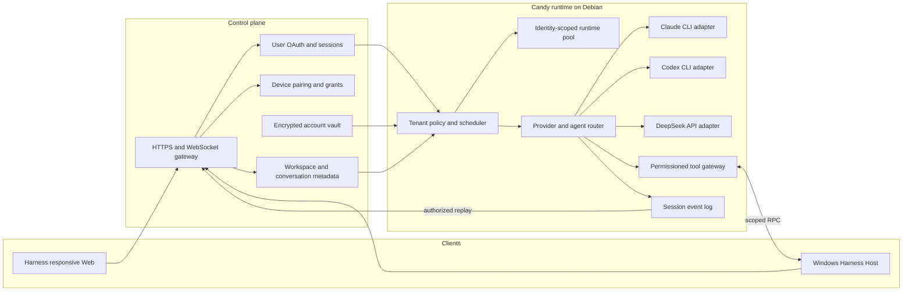

# Agent Note: Multi-tenant CLI agent runtime

Status: proposed

English | [中文](2026-09-02-multi-tenant-cli-agent-runtime.zh.md)

## Problem

Candy needs to serve multiple users through desktop and mobile browsers plus Windows hosts while running coding agents on a Debian server. The inherited Harness supplies an agent loop, plugins, sessions, a responsive Web service, theme and brand plugins, and Windows-local filesystem capabilities, but it does not define tenant identities, isolated provider accounts, remote Windows ownership, or a control-plane contract.

The product must run Claude and Codex through their CLIs and DeepSeek through its API. Reusing a CLI installation or worker infrastructure must never reuse a user's credentials, home directory, process environment, session, workspace grant, or event stream.

## Proposal

Keep the Harness agent loop as Candy's execution core and add tenant-aware services around its existing extension points. Keep authentication, device ownership, durable metadata, encrypted credentials, and policy in the control plane. Run each agent job in an identity-scoped runtime on Debian. Run a Harness Host on Windows and reuse its filesystem, directory-picker, PowerShell, Git, sandbox, Remote, responsive Web, theme, and brand-slot plugins. Candy adds tenant binding and remote routing around those capabilities instead of replacing them.

Desktop and mobile browsers use the same Harness Web service. Candy does not ship a separate mobile application, UI framework, color palette, or theme selector. Product identity uses the existing brand slots, while appearance continues to use the Harness theme plugin.

Claude Agent SDK is outside this design. Claude CLI and Codex CLI are subprocess providers; DeepSeek is an API provider. A provider adapter must emit the same normalized lifecycle events without hiding provider-native diagnostics.

## Target architecture

The control plane is the authority for `userId`, `deviceId`, `accountId`, workspace grants, and session membership. Candy accepts these values only from authenticated control-plane assertions and never from client-selected request fields.

The runtime pool key is `userId + provider + accountId`. Workers may share immutable CLI binaries, package caches, and dispatch infrastructure. Workers must not share credential files, writable home directories, environment overlays, process trees, session stores, or workspace mounts across pool keys.

## Runtime contracts

1. The control plane exchanges a short-lived, audience-bound execution assertion for each run. Candy validates its issuer, audience, expiry, tenant, account, session, device, workspace grant, and nonce before scheduling work.
2. Each CLI invocation receives an isolated home directory, minimal environment, bounded working directory, cancellation handle, output limit, and audit context. Secrets are injected for that invocation and are not written to the shared repository or event log.
3. The provider adapter normalizes start, text, reasoning, tool request, tool result, usage, completion, cancellation, and failure events. It retains a redacted provider-native diagnostic for troubleshooting.
4. Windows operations require an online paired device and a grant that names the workspace and allowed operation class. The companion resolves canonical paths and rejects traversal outside the grant.
5. Session events are append-only and partitioned by tenant. Replay, subscription, export, and deletion authorize against session membership on every request.
6. A child agent inherits a subset of the parent run's account, workspace, tool, token, time, and concurrency grants. Child creation cannot widen any grant.

## Delivery plan

| Task | Outcome | Depends on | Exit evidence |
|---|---|---|---|
| R0 | Fork boundary and threat model | None | Architecture note accepted and abuse cases covered by tests or named follow-up tasks |
| R1 | Tenant, provider-account, credential, and grant model | R0 | Cross-tenant access tests fail closed and credential records are encrypted |
| R2 | DeepSeek API, Claude CLI, and Codex CLI adapters | R1 | Contract suite passes for streaming, cancellation, errors, and usage |
| R3 | Multi-agent orchestration | R2 | Parent-child grants, budgets, cancellation, and audit tests pass |
| R4 | Harness Web and provider-account configuration | R1, R2 | Desktop and mobile browsers use one responsive service and users manage only their own accounts |
| R5 | Tenant binding for Windows Harness Hosts | R1, R3 | Registered-host operations reuse Harness plugins and pass tenant, path, and permission tests |
| R6 | Migration, end-to-end validation, and release | R2, R3, R4, R5 | Staged rollout meets security, recovery, latency, and rollback gates |

### R0 — Boundary and threat model

R0 is delivered as [Candy Runtime Boundaries](../../../../docs/candy-runtime-boundaries.md), which every later task answers to.

- [x] Record the inherited Harness capabilities and the Candy-owned control-plane responsibilities — its *Inherited Harness Capabilities* and *Candy-Owned Control Plane* sections, including the rule that Candy attaches to an existing Harness boundary rather than forking a parallel implementation.
- [x] Model credential theft, tenant confusion, path traversal, event leakage, process escape, replay, and confused-deputy threats — its *Abuse Cases* section carries one paragraph per threat.
- [x] Define trust boundaries for browser, mobile client, control plane, Candy runtime, provider process, and Windows companion — its *Trust Boundaries* section.
- [x] Add architecture-decision and abuse-case review gates to subsequent tasks — its *Review Requirements* section states one per task, R1 through R6, and the delivery table above carries the matching exit evidence. R1's gate is met: cross-tenant reads fail closed and revoked accounts cannot start new work in `dsh-run-admission`'s suite, reads are redacted by `redactCredential`, and every identity claim is proven to sit inside the assertion's MAC rather than only the tenant — a claim moved outside the signature would leave a single-claim test passing while becoming forgeable.

### R1 — Tenant and account foundation

- [x] Define stable identifiers and schemas for user, device, provider account, workspace grant, conversation, session, run, and child run ([`dsh-control-plane`](../../implemented/architecture/2026-09-02-candy-control-plane-identifiers.md)).
- [x] Implement encrypted credential storage with versioned envelopes, key rotation, redacted reads, revocation, and audit events ([`dsh-credential-vault`](../../implemented/architecture/2026-09-02-candy-credential-vault.md)). The accounts and their sealed credentials are now durable ([ports with nothing behind them](../../implemented/architecture/2026-09-04-ports-with-nothing-behind-them.md)): `dsh-control-plane-store` holds them and each tenant's allowance in one `storage-domain` domain over SQLite, so two of admission's three ports have implementations and a restart keeps what a tenant configured. Audit records are still only returned, and the store that persists them remains unbuilt.
- [x] Implement short-lived execution assertions and reject client-supplied tenant or account overrides ([`dsh-execution-assertion`](../../implemented/architecture/2026-09-02-candy-execution-assertions.md)) — and the replay store the nonce implies is built ([one step decides a nonce](../../implemented/architecture/2026-09-03-one-step-decides-a-nonce.md)): `admitRun` requires a `spendNonce` port and never retries a spent nonce, so that port is the whole of the protection, and the implementation it invites — look the nonce up, then insert it — admits both copies of a replayed token. `RunReplayStore` decides in one synchronous step, holds a record exactly while its assertion stays admissible, and keys by tenant so one tenant cannot deny another's run by spending a value first. It serves one process; a deployment running more than one needs a durable store, which now has a written contract rather than an inferred one.
- [x] Partition runtime homes, process ownership, event logs, caches with private content, quotas, and cleanup by pool key ([`dsh-runtime-pool`](../../implemented/architecture/2026-09-02-candy-runtime-pool-partitioning.md)); the key and each pool's root are derived, and a Claude CLI run is now placed in its pool by construction — [`dsh-claude-cli-binding`](../../implemented/architecture/2026-09-03-admitted-run-to-claude-cli-launch.md) reads the process's home, working directory, credential and spend ceiling out of the admitted run, so no caller pairs one tenant's directory with another's key. Creating the directory is now owned too: `openRuntimePool` makes a pool root private with an applied mode rather than a requested one and refuses to invent a pool base the deployment never provisioned ([a pool root is made private](../../implemented/architecture/2026-09-03-a-pool-root-is-made-private.md)) — the `mkdir` every caller had hand-rolled leaves an already-existing root at whatever permissions it had, and that root is where the tenant's credential is written. Enforcing quotas and cleanup stay with the unbuilt pool runtime, as do the pool base's own permissions. The steps now compose in one place ([the order had no owner](../../implemented/architecture/2026-09-04-the-order-had-no-owner.md)): `startRun` admits, funds and places one run, and closes the ledger record it opened when the placement refuses, so a failed placement does not leave a parent short until the lease expires. It is not a scheduler — which run starts, and whether a tenant may start another, are still decisions nothing makes.

### R2 — Provider adapters

Adapters implement the inherited `dsh-llm` seam rather than a Candy-owned one. `LlmAdapter` is the provider base, `StreamChunk` already carries block start, text, reasoning, tool-call deltas, usage, and one terminal finish, and `dsh-llm/invariant` enforces that grammar around every provider stream. Candy adds providers to that seam and does not define a second lifecycle vocabulary.

- [x] Implement the DeepSeek API adapter with streaming, tool calls, usage, retry classification, cancellation, and redacted errors — inherited as `dsh-llm-deepseek` (`DeepSeekAdapter`), with `dsh-llm-pi-ai` a second implementation of the same seam.
- [x] Implement the Claude CLI adapter with isolated home, non-interactive input, structured output parsing, cancellation, and process-tree cleanup ([`dsh-claude-cli-protocol`](../../implemented/architecture/2026-09-03-claude-cli-stream-protocol.md) and [`dsh-llm-claude-cli`](../../implemented/architecture/2026-09-03-claude-cli-llm-adapter.md)). Candy parses `--output-format stream-json` directly rather than reusing the Agent SDK path `dsh-subagent-claude-code` takes, because that SDK supplies an agent loop where this seam needs a model call. The route is narrow by decision, not by omission: it serves one-shot text calls and refuses a conversation, tool schemas, and every generation control the CLI has no flag for, each by name. Its output is bounded and redacted too ([a piped stream is the caller's to bound](../../implemented/architecture/2026-09-04-a-piped-stream-is-the-callers-to-bound.md), [a provider quoting its key back](../../implemented/architecture/2026-09-04-a-provider-quoting-its-key-back.md)): the seam hands a `'pipe'` stream to its decoder, so nothing but this route could bound it, and the boundaries page asks for provider output to reach a caller through a bounded, redacted adapter. The contract suite's redaction assertion had been passing because the recorded fixture holds no key, not because anything removed one. The agent loop therefore cannot use it yet — closing that needs the multi-turn and tool decisions the adapter note records as open.
- [ ] Implement the Codex CLI adapter with the same isolation and lifecycle guarantees. Blocked on recording real output, not on design. What `codex` 0.153.0 was observed to do: `codex exec --json` writes JSONL to stdout; the prompt is a positional argument, and stdin must be closed or the command waits on it; isolation is `CODEX_HOME` plus `--ephemeral`, `--ignore-user-config`, `-s read-only`, `-C <dir>` and `--skip-git-repo-check`; there is no system-prompt flag and no flag accepting caller tool schemas. Observed frames were `{"type":"thread.started","thread_id"}`, `{"type":"turn.started"}`, `{"type":"error","message"}`, and `{"type":"item.completed","item":{"id","type","message"}}` — a thread/turn/item model, unlike the Claude CLI's Messages-API events. The content, completion and usage frames were never reached: this environment's egress policy denies `api.openai.com`, so no run gets past connection, and `developers.openai.com` is blocked too, while the npm package ships only a launcher with no schema. Writing the translator from the frame names alone would be the guess the Claude CLI work avoided, where three behaviors contradicted the reasonable assumption. It needs one recorded run from a host with egress and a key.
- [x] Build one provider contract suite with success, malformed output, timeout, quota, cancellation, crash, and secret-leak fixtures ([`dsh-llm-adapter-contract`](../../implemented/architecture/2026-09-03-llm-adapter-conformance.md)). It runs at the seam, because the one-terminal-chunk guarantee belongs to `LlmRuntime` rather than to an adapter, and every adapter on the seam runs it — `dsh-llm-deepseek`, `dsh-llm-pi-ai`, and `dsh-llm-claude-cli`. Running it found and fixed a real process leak: a consumer that stopped reading left the CLI running. Timeout, quota and crash collapse into one failed-run case, since the suite asserts what an adapter owes a failure rather than how it was caused; malformed output stays with each adapter's own wire parser.

### R3 — Multi-agent orchestration

- [ ] Add an agent registry and routing policy for explicit selection, capability matching, and permitted fallback. The registry half is inherited: [`dsh-agent-presets`](../../../../packages/preset/agent-presets) already lists every composed agent preset a deployment or user configured, reports a reason when one cannot start a session, and lets a session select one explicitly, while [`dsh-subagent`](../../../../packages/subagent/subagent)'s `tool-subagent` already carries a `ModelSelectionPolicy` allowlist and resolves an explicit provider/model override through the live LLM registry before delegating a child. Capability matching and fallback do not yet have a real second option to match or fall back to: [`dsh-llm-claude-cli`](../../../../packages/llm/llm-claude-cli) refuses a conversation, tool schemas, and non-text content by name, so it cannot serve the main agent loop today, and Codex CLI has no adapter — a routing policy built now would compare one usable route against itself, which is not a policy a test can distinguish from doing nothing. What is genuinely Candy's to add — restricting a tenant to a subset of an otherwise-shared preset roster or route allowlist — needs the scheduler this release has not built, since that is where a tenant's session and its Candy identity meet.
- [ ] Add parent-child run records with parent-subset grants, depth, concurrency, token, time, and cost budgets. Depth and grants are inherited, not Candy's to build: `dsh-subagent` already refuses a child past `maxDepth` and pins a delegated child's sandbox mode and approval policy to its parent's. The budget half is built ([`dsh-run-budget`](../../implemented/architecture/2026-09-03-run-budget-delegation.md)): a child's tokens, wall time, money and concurrency are subtracted from its parent at reservation, so over-delegation is impossible rather than detectable, and the unspent remainder returns at settlement. Concurrency is conserved across the whole tree rather than one level of it ([concurrency is conserved across a tree](../../implemented/architecture/2026-09-04-concurrency-is-conserved-across-a-tree.md)): a child costs its parent the slot it occupies plus every slot it may hand down, because charging one slot per child let a grant of four seed 1364 live runs at depth five, which is not the parent-subset rule the boundaries page states. An exhausted run is already refused at the gate: `admitRun` reads the allowance a run is started against through a required `findBudget` port and denies before it spends the nonce or opens a credential ([the budget nothing consulted](../../implemented/architecture/2026-09-03-admission-enforces-the-budget.md)). For a child run that allowance is its parent's remainder, read from the ledger, so an exhausted parent stops a child while its assertion is still valid rather than after its nonce is gone. Money is measured on the one route that reports it: the Claude CLI's `total_cost_usd` now reaches `TokenUsage.costMicroUsd` ([the bill the provider already sent](../../implemented/architecture/2026-09-03-provider-reported-cost.md)), so a tenant's spend is a recorded fact rather than a price table a caller maintains. The run record is built ([`dsh-run-ledger`](../../implemented/architecture/2026-09-03-run-ledger-settles-exactly.md)): it holds what each open run was given and has left, closes a subtree with its root, and releases an abandoned hold on a lease — exactly rather than by estimate, since every charge went through it. What remains is durability: the records are plain data and nothing stores them, so a restart loses every open run, and nothing drives the expiry clock.
- [ ] Propagate cancellation through children, provider processes, tools, and event streams, then verify complete process cleanup. The provider-process half is verified: cancelling or abandoning a bound Claude CLI run reaps both the CLI and a process it started, checked against real pids in [`dsh-claude-cli-binding`](../../implemented/architecture/2026-09-03-admitted-run-to-claude-cli-launch.md) rather than against a scripted handle. Children, tools, and event streams are inherited from `dsh-subagent` and the tool seam and are not verified through a Candy run.
- [ ] Record routing, delegation, tool authorization, usage, and terminal state in a tenant-scoped audit trail. Started at the one place records already existed and were being lost: `admitRun` returned the vault's audit only on success and discarded the record `openCredential` produces on its failing branch, losing the cross-tenant access attempts the vault had detected. Every admission outcome now carries `audits` ([a denied run is the event the audit trail is for](../../implemented/architecture/2026-09-03-run-admission-audits-every-outcome.md)), and every denial past the assertion now names the tenant, account and run it refused ([a denial that names nobody is not a record](../../implemented/architecture/2026-09-03-a-denial-names-who.md)) — a replayed nonce is the clearest attack signal admission can observe, and it was being reported without an identity a caller could log. The surface is still only the vault's operations — routing, delegation, tool authorization, usage and terminal state need the scheduler and orchestration this release has not built — and nothing persists the records; the tenant-partitioned store stays with the caller.

The boundaries page also asks for an audit record per launched provider or tool process, and that one is not a Candy gap to patch locally. A vault record is written once per admitted run, while a run launches a process per invocation — `dsh-claude-cli-binding`'s accounting cases run two under one admission — so the two are not one-to-one even for credential access. No spawner in this repository emits a launch record: `dsh-subprocess` declares no such event, so the harness's own bash, pwsh and language-server processes are unrecorded as well. Implementing it at the seam every spawner already routes through is the correct shape, and it needs the tenant attribution the seam has no notion of, which is the scheduler's to supply.

### R4 — Harness Web and account configuration

- [x] Add provider-account list, create, validate, select-default, revoke, and delete APIs with ownership checks ([`dsh-provider-accounts`](../../implemented/architecture/2026-09-03-provider-account-management.md)); the Web controller and provider-specific validation probes remain.
- [ ] Extend the existing Harness Web settings for DeepSeek API keys and server-side Claude CLI and Codex CLI login states; verify the same routes at desktop and mobile viewport sizes.
- [ ] Reuse the Harness theme and brand-slot plugins; remove any Candy-specific palette, theme selector, duplicated layout, or separate mobile surface.
- [ ] Expose safe diagnostics without returning tokens, credential paths, raw environment values, or another tenant's metadata.

### R5 — Windows Harness Host tenant binding

- [ ] Register each Windows Harness Host to one user and device, then bind its existing Remote capabilities to short-lived Candy assertions. The Remote layer exists (`dsh-api-gateway` carries typed calls, `dsh-api-remotes` decides what is exposed), but a *registered host* does not: `host/` is the local web-GUI half — HTTP server, SPA server, directory picker, plugin inventory — with no notion of a machine addressed by a server URL, and the harness's only identity is `dsh-anonymous-user-id`, a per-installation UUID designed not to identify a user. This bullet therefore builds the remote-host concept before it can bind anything to it, and it needs R1's control plane running as a service rather than as the libraries this release shipped.
- [ ] Reuse `fs-local`, directory-picker, PowerShell, Windows ACL sandbox, and API Gateway plugins behind explicit workspace roots and operation-class grants. All five exist: [`dsh-fs-local`](../../../../packages/fs/fs-local), [`dsh-directory-picker`](../../../../packages/host/directory-picker) with native, browse and adaptive backends, [`dsh-pwsh-local`](../../../../packages/shell/pwsh-local) with its sandbox and persistent tools, [`dsh-sandbox-windows-acl`](../../../../packages/sandbox/sandbox-windows-acl), and [`dsh-api-gateway`](../../../../packages/api/gateway). The ACL sandbox is the hardest piece and is already real — a restricted token confines writes to the workspace and a private temp directory, every Win32 call is checked so a child is never spawned unrestricted, and it reports `partial` because the token must retain Everyone to initialize and NTFS hard links alias one file object across paths. There is no Git plugin to reuse: the repository has only `dsh-webhook-github`, an unrelated webhook ingress, so Git reaches a workspace through the bash and pwsh tools like any other command.
- [ ] Add server URL, pairing, connectivity, revocation, offline detection, reconnect, idempotency, bounded output, and approval state without defining a second file-operation protocol.
- [ ] Test tenant routing, Unicode and long paths, branch discovery, concurrent edits, device revocation, reconnect, junction or symlink escape, and malicious path inputs on Windows.

### R6 — Migration and release

- [ ] Add configuration and metadata migrations from ClauGod concepts to Candy without importing Claude SDK credentials or sessions.
- [ ] Run end-to-end scenarios for each provider, multiple tenants, multiple accounts, child agents, Windows workspaces, and reconnect replay.
- [ ] Deploy behind feature flags with per-provider canaries, resource dashboards, security alerts, backups, and a tested rollback procedure.
- [ ] Remove obsolete Claude SDK paths only after migration verification and publish operator and user recovery guidance.

## Alternatives considered

**Continue building a custom agent loop.** This retains complete control but duplicates the Harness plugin, session, tool, and event foundations. The team would spend more time rebuilding infrastructure before improving tenant isolation and provider support.

**Use Claude Agent SDK as the server runtime.** This makes Claude the architectural center and weakens parity with Codex CLI and DeepSeek. It also conflicts with the requirement to standardize Claude and Codex as CLI subprocess providers.

**Share one authenticated CLI home between users.** This reduces login friction but makes credential attribution, revocation, audit, and data isolation unreliable. Candy permits shared immutable installations, not shared authenticated state.

**Build a separate mobile client and Candy color system.** This duplicates the responsive Harness Web surface and its theme registry, increases visual drift, and creates two client release paths. Candy instead composes the existing Web, theme, and brand-slot plugins.

## Acceptance criteria

1. Two concurrent tenants can use the same provider and repository name without sharing credentials, writable homes, processes, session events, workspace grants, or cached private content.
2. Claude CLI, Codex CLI, and DeepSeek API pass one lifecycle contract suite, including cancellation and provider failure.
3. A child agent cannot exceed its parent's account, workspace, tool, token, time, or concurrency grants.
4. A revoked account, device, or workspace grant blocks new work immediately and prevents unauthorized replay or reconnect.
5. Windows operations cannot escape an explicitly granted canonical workspace root and remain attributable to one user, device, session, and run.
6. Desktop and mobile browsers use the same responsive Harness Web routes and can reconnect and replay authorized session state without direct access to provider credentials.
7. Operators can detect, contain, and audit cross-tenant attempts, orphaned processes, quota violations, and provider outages without reading user secrets.

## Risks

CLI output and authentication formats can change without stable machine contracts. Adapters need version probes, strict parsers, compatibility fixtures, and fail-closed behavior.

Subprocess isolation is weaker than a complete host boundary if all workers share one operating-system identity. Production deployment may require per-tenant operating-system users or stronger sandboxing after measurement and threat review.

Windows RPC expands the attack surface to local files and command execution. Narrow grants, local confirmation for sensitive classes, canonical path checks, signed messages, and revocation are release blockers.

The control plane and Candy can drift on identity or authorization semantics. A versioned assertion schema, compatibility window, contract tests, and coordinated rollout must keep both sides aligned.
