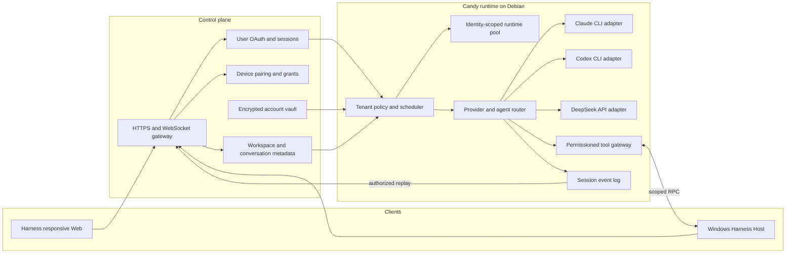

# Agent Note: 多租户 CLI agent 运行时

Status: proposed

[English](2026-09-02-multi-tenant-cli-agent-runtime.md) | 中文

## Problem

Candy 需要通过桌面与手机浏览器以及 Windows Host 服务多个用户，同时在 Debian 服务器上运行 coding agent（编程智能体）。继承的 Harness 提供 agent loop（智能体循环）、插件、会话、响应式 Web 服务、主题与品牌插件以及 Windows 本地文件系统能力，但没有定义租户身份、相互隔离的提供方账户、远程 Windows 所有权或控制平面约定。

产品必须通过 CLI（命令行界面）运行 Claude 和 Codex，并通过 API 运行 DeepSeek。系统可以复用 CLI 安装或 worker 基础设施，但绝不能复用用户凭据、主目录、进程环境、会话、工作区授权或事件流。

## Proposal

保留 Harness agent loop 作为 Candy 的执行核心，并围绕其现有扩展点增加租户感知服务。控制平面负责身份验证、设备所有权、持久元数据、加密凭据和策略。每个 agent 任务在 Debian 上的身份隔离运行时中执行。在 Windows 上运行 Harness Host，并复用其文件系统、目录选择、PowerShell、Git、沙箱、Remote、响应式 Web、主题和品牌 slot 插件。Candy 在这些能力外围增加租户绑定和远程路由，而不替换它们。

桌面与手机浏览器使用相同的 Harness Web 服务。Candy 不交付独立手机应用、UI 框架、调色板或主题选择器。产品身份使用现有品牌 slot，外观继续使用 Harness 主题插件。

此设计不使用 Claude Agent SDK。Claude CLI 和 Codex CLI 是子进程提供方；DeepSeek 是 API 提供方。提供方适配器必须发出统一的生命周期事件，同时保留提供方原生诊断信息。

## Target architecture

控制平面是 `userId`、`deviceId`、`accountId`、工作区授权和会话成员关系的权威来源。Candy 只从通过身份验证的控制平面断言中接受这些值，绝不从客户端选择的请求字段中接受这些值。

运行时池键为 `userId + provider + accountId`。worker 可以共享不可变 CLI 二进制文件、包缓存和调度基础设施。不同池键之间不得共享凭据文件、可写主目录、环境覆盖、进程树、会话存储或工作区挂载。

## Runtime contracts

1. 控制平面为每次运行签发短期且绑定受众的执行断言。Candy 在调度任务前验证签发者、受众、有效期、租户、账户、会话、设备、工作区授权和 nonce。
2. 每次 CLI 调用获得隔离主目录、最小环境、受限工作目录、取消句柄、输出限制和审计上下文。秘密只注入该次调用，不写入共享仓库或事件日志。
3. 提供方适配器统一开始、文本、推理、工具请求、工具结果、用量、完成、取消和失败事件。它保留经过脱敏的提供方原生诊断信息以便排错。
4. Windows 操作要求已配对设备在线，并且授权必须指定工作区和允许的操作类别。配套程序解析规范路径并拒绝越过授权范围的路径遍历。
5. 会话事件仅追加并按租户分区。系统在每次回放、订阅、导出和删除请求中依据会话成员关系授权。
6. 子 agent 继承父运行的账户、工作区、工具、token、时间和并发授权的子集。创建子 agent 不能扩大任何授权。

## Delivery plan

| Task | Outcome | Depends on | Exit evidence |
|---|---|---|---|
| R0 | fork 边界和威胁模型 | 无 | 架构说明获批，滥用场景由测试或具名后续任务覆盖 |
| R1 | 租户、提供方账户、凭据和授权模型 | R0 | 跨租户访问测试快速失败，凭据记录已加密 |
| R2 | DeepSeek API、Claude CLI 和 Codex CLI 适配器 | R1 | 流式传输、取消、错误和用量的约定测试通过 |
| R3 | 多 agent 编排 | R2 | 父子授权、预算、取消和审计测试通过 |
| R4 | Harness Web 和提供方账户配置 | R1, R2 | 桌面与手机浏览器使用同一响应式服务，用户只能管理自己的账户 |
| R5 | Windows Harness Host 租户绑定 | R1, R3 | 已注册 Host 操作复用 Harness 插件并通过租户、路径与权限测试 |
| R6 | 迁移、端到端验证和发布 | R2, R3, R4, R5 | 分阶段发布满足安全、恢复、延迟和回滚门禁 |

### R0 — Boundary and threat model

R0 已交付为 [Candy 运行时边界](../../../../docs/candy-runtime-boundaries.zh.md)，后续每一项任务都对它负责。

- [x] 记录继承的 Harness 能力以及归 Candy 所有的控制平面职责 —— 见其 *Inherited Harness Capabilities* 与 *Candy-Owned Control Plane* 两节，其中包括这条规则：Candy 附着到既有的 Harness 边界上，而不是分叉出一份平行实现。
- [x] 建模凭据窃取、租户混淆、路径遍历、事件泄漏、进程逃逸、重放和 confused-deputy 威胁 —— 其 *Abuse Cases* 一节为每一种威胁各写了一段。
- [x] 定义浏览器、手机客户端、控制平面、Candy 运行时、提供方进程和 Windows 配套程序的信任边界 —— 见其 *Trust Boundaries* 一节。
- [x] 为后续任务增加架构决策和滥用场景评审门禁 —— 其 *Review Requirements* 一节为 R1 到 R6 每一项任务各写了一条，而上面的交付表承载对应的退出证据。R1 的门禁已满足：`dsh-run-admission` 的测试集证明跨租户读取快速失败、已吊销账户无法开启新工作，`redactCredential` 负责脱敏读取，而每一个身份声明都被证明位于断言的 MAC 之内，而不只是租户 —— 一个被移到签名之外的声明，会让只测一个声明的用例继续通过，同时变得可伪造。

### R1 — Tenant and account foundation

- [x] 为用户、设备、提供方账户、工作区授权、对话、会话、运行和子运行定义稳定标识符及 schema([`dsh-control-plane`](../../implemented/architecture/2026-09-02-candy-control-plane-identifiers.zh.md))。
- [x] 实现带版本封装、密钥轮换、脱敏读取、撤销和审计事件的加密凭据存储（[`dsh-credential-vault`](../../implemented/architecture/2026-09-02-candy-credential-vault.zh.md)）。账户及其密封凭据现在是持久的（[背后什么都没有的端口](../../implemented/architecture/2026-09-04-ports-with-nothing-behind-them.zh.md)）：`dsh-control-plane-store` 把它们与每个租户的额度放在一个走 SQLite 的 `storage-domain` 域里，因此准入的三个端口里有两个有了实现，而重启会保住租户配置过的东西。审计记录仍然只是被返回，持久化它们的存储仍未构建。轮换现在可以被表达了（[把每个租户都锁在门外的轮换](../../implemented/architecture/2026-09-06-a-rotation-that-locked-every-tenant-out.zh.md)）:保险库接受一个由被保留版本组成的密钥环,而调度器构造出来的那个只装了一把密钥,于是改动版本会让每个租户的每一次运行都被以 `unknown-key` 拒绝,直到旧值被恢复。`retiredCredentialKeys` 指名一个运行时仍会打开哪些版本;而推动那一轮让退役密钥终于可以离场的重新封装,属于运维人员。一次吊销现在也能停下已经在进行中的工作（[只拦下了下一次运行的吊销](../../implemented/architecture/2026-09-05-a-revocation-that-only-stopped-the-next-run.zh.md)）:销毁信封会拦下下一次准入,却触及不到任何已经持有已解开凭据的东西,于是一次存活的运行在其账户被吊销之后仍继续给租户记账。计量监听器现在在每次调用时读取账户记录,并在触及提供方之前以 `CREDENTIAL_REVOKED` 拒绝。这次运行也会在下一次清扫时被结束（[被拒绝却没有被结束的运行](../../implemented/architecture/2026-09-06-a-run-refused-but-not-ended.zh.md)）:只拒绝它的调用,会让它在租约剩下的时间里一直开着,占着出资方的额度,而它已经花掉的部分未被记账——一次只为了被拒绝而存在的运行。吊销终究不需要以事件形式抵达运行时,因为清扫本来就在轮询;一次其账户已无法为它授权的运行会在那里被结算,依据与 `meterRequest` 相同,而一次存储无法为其作答的运行则被留给它的租约。终止这样一次运行留下的提供方进程,现在有了一个能够到它的位置（[一次结算过却仍在跑的运行](../../implemented/architecture/2026-09-06-a-run-that-settled-but-kept-running.zh.md)）：`RunScheduler.registerDisposer` 为每个运行保有一个处置器，在该运行或某个后代关闭、结算写入之前被调用；而 `disposableSpawn` 让一个提供方绑定只需围绕它已经交给适配器的那个 `spawn` 函数组合一层就能得到这项能力。现在有一个绑定去调用它了（[那个无法共享的适配器](../../implemented/architecture/2026-09-06-the-adapter-that-could-not-be-shared.zh.md)）：`dsh-claude-cli-route` 围绕它交给 `ClaudeCliAdapter` 的那个 `spawn` 组合出 `disposableSpawn`，于是因故结束一次运行能够触及该运行自己那次调用所启动的进程。
- [x] 实现短期执行断言，并拒绝客户端提供的租户或账户覆盖值（[`dsh-execution-assertion`](../../implemented/architecture/2026-09-02-candy-execution-assertions.zh.md)） —— 而 nonce 所隐含的那个重放存储已经构建（[一个步骤决定一个 nonce](../../implemented/architecture/2026-09-03-one-step-decides-a-nonce.zh.md)）：`admitRun` 要求一个 `spendNonce` 端口，并且从不重试一个已消费的 nonce，因此那个端口就是防护的全部，而它所诱使写出的实现 —— 先查这个 nonce，再插入它 —— 会把被重放令牌的两份副本都准入。`RunReplayStore` 在一个同步步骤里做决定，恰好在断言仍可被准入期间持有记录，并按租户为键，使一个租户无法通过抢先消费某个值来拒绝另一个租户的运行。它服务于一个进程；运行多于一个进程的部署需要一个持久化存储，而那份契约现在是写下来的，不再靠推断。令牌的版本前缀现在名副其实（[什么都没签的版本前缀](../../implemented/architecture/2026-09-05-a-version-prefix-that-signed-nothing.zh.md)）:MAC 此前只覆盖载荷,因此那个承诺"将来声明集会签发 `v2` 而不是重新解读 `v1`"的前缀,只是一段签名数据块前面未经认证的文本。它现在处在 MAC 之内,代价是在唯一的声明集还是 `v1` 时改变一次格式。
- [x] 按池键隔离运行时主目录、进程所有权、事件日志、包含私有内容的缓存、配额和清理（[`dsh-runtime-pool`](../../implemented/architecture/2026-09-02-candy-runtime-pool-partitioning.zh.md)）；键与每个池的根目录已被推导，而一次 Claude CLI 运行现在按构造就被放进它的池里 —— [`dsh-claude-cli-binding`](../../implemented/architecture/2026-09-03-admitted-run-to-claude-cli-launch.zh.md) 从被准入的运行里读出进程的主目录、工作目录、凭据与花费上限，因此没有任何调用方会把一个租户的目录与另一个租户的密钥配在一起。创建目录现在也已归属：`openRuntimePool` 用一个被施加而非被请求的模式把池根目录设为私有，并拒绝凭空造出部署从未准备过的池基目录（[池根目录是被设为私有的](../../implemented/architecture/2026-09-03-a-pool-root-is-made-private.zh.md)）—— 每个调用方手写的那个 `mkdir` 会让一个已经存在的根目录保留它原有的权限，而那个根目录正是租户凭据被写入的地方。池根目录现在也是唯一被告知给 CLI 用来保存状态的地方（[一个没有东西必须服从的 home](../../implemented/architecture/2026-09-05-a-home-that-nothing-had-to-obey.zh.md)）：子进程的 `HOME` 是租户的，而环境中现成的 `CLAUDE_CONFIG_DIR` 或 XDG 基础目录 —— 既不是凭据形状的名字，也不是路由开关，因此没有任何东西清洗它们 —— 指名了它之外的一个目录，于是每个租户共享同一个配置与账户状态目录。`SCRUBBED_STATE_VARIABLES` 为它们设置墓碑，因此隔离依赖的是池根目录，而不是部署的环境卫生。强制配额与清理仍属于尚未构建的池运行时，池基目录自身的权限也是。该池所持有的凭据不再经由一条无人看管的流离开（[脱敏够不到的那条流](../../implemented/architecture/2026-09-05-the-stream-redaction-could-not-reach.zh.md)）:CLI 的 stderr 是被继承的,于是一条引述了被拒密钥的诊断会把它写到宿主自己的控制台上,而同样的文本在 stdout 上却被脱敏。它现在被收集并受界,其尾部经由每个块本就要经过的脱敏抵达一次死掉运行的失败。这些步骤现在在一处组合起来了（[那个顺序没有主人](../../implemented/architecture/2026-09-04-the-order-had-no-owner.zh.md)）：`startRun` 准入、拨款并放置一次运行，并在放置被拒时关闭它自己开启的账本记录，因此一次失败的放置不会让父运行一直少掉一份，直到租约到期。它不是调度器 —— 哪一次运行开始、以及某个租户还能不能再开一次，仍然是没有任何东西在做的决定。

### R2 — Provider adapters

适配器实现的是继承而来的 `dsh-llm` seam，而不是 Candy 自有的 seam。`LlmAdapter` 是提供方基类，`StreamChunk` 已经承载块开始、文本、推理、工具调用增量、用量与一次终止 finish，而 `dsh-llm/invariant` 会在每条提供方流周围强制执行该语法。Candy 只向该 seam 增加提供方，不定义第二套生命周期词汇。

- [x] 实现 DeepSeek API 适配器，覆盖流式传输、工具调用、用量、重试分类、取消和脱敏错误——已作为 `dsh-llm-deepseek`（`DeepSeekAdapter`）继承而来，`dsh-llm-pi-ai` 是同一 seam 的第二个实现。
- [x] 实现 Claude CLI 适配器，具备隔离的 home、非交互输入、结构化输出解析、取消与进程树清理（[`dsh-claude-cli-protocol`](../../implemented/architecture/2026-09-03-claude-cli-stream-protocol.zh.md) 与 [`dsh-llm-claude-cli`](../../implemented/architecture/2026-09-03-claude-cli-llm-adapter.zh.md)）。Candy 自行解析 `--output-format stream-json`，而不复用 `dsh-subagent-claude-code` 所走的 Agent SDK 路径，因为该 SDK 提供的是一个智能体循环，而这条缝隙需要的是一次模型调用。这条路由的窄是决定的结果而非遗漏：它服务一次性文本调用，并逐项具名拒绝对话、工具模式，以及 CLI 没有对应开关的每一个生成控制项。它的输出也是有界且脱敏的（[一条被 pipe 出来的流，由调用方来界定](../../implemented/architecture/2026-09-04-a-piped-stream-is-the-callers-to-bound.zh.md)、[一个把自己密钥引述回来的提供方](../../implemented/architecture/2026-09-04-a-provider-quoting-its-key-back.zh.md)）：缝隙把一条 `'pipe'` 流交给它的解码器，因此除了这条路由没有别的东西能界定它，而边界页面要求提供方输出经由一个有界、脱敏的适配器抵达调用方。约定套件的脱敏断言此前之所以通过，是因为录制到的 fixture 里没有密钥，而不是因为有什么东西把它去掉了。因此智能体循环目前还不能使用它 —— 补上这一点需要适配器笔记中记录为待决的多轮与工具决定，而这个决定依然悬而未决：一次录制的运行确定了 CLI 自己的输入实际会做什么，而不是去发明一种转录格式（[stdin 承载不了的对话](../../implemented/architecture/2026-09-06-a-conversation-stdin-could-not-carry.zh.md)）。而与那个决定无关、多租户本身所需要的东西现在已经单独建好了（[那个无法共享的适配器](../../implemented/architecture/2026-09-06-the-adapter-that-could-not-be-shared.zh.md)）：[`dsh-claude-cli-route`](../../../../packages/control-plane/claude-cli-route) 挂载一条路由，其凭据与池在每次调用时都从驱动该请求所属会话的那次运行中重新解析，因此一个多租户运行时即便只是要服务这条路由本就能服务的那些一次性调用（`dsh-compaction`、`dsh-session-title`），也不再需要手工为每个池构造和处置一个 `ClaudeCliAdapter`——目前还没有任何部署去挂载它，而一条支持多轮的路由仍需要先有上面那个决定，主循环才可能用上它。
- [ ] 使用相同的隔离和生命周期保证实现 Codex CLI 适配器。受阻于录制真实输出，而不是受阻于设计。对 `codex` 0.153.0 实测到的事实：`codex exec --json` 把 JSONL 写到 stdout；提示词是位置参数，且必须关闭 stdin，否则命令会一直等它；隔离手段是 `CODEX_HOME` 加上 `--ephemeral`、`--ignore-user-config`、`-s read-only`、`-C <dir>` 与 `--skip-git-repo-check`；没有系统提示词开关，也没有接受调用方工具模式的开关。观察到的帧是 `{"type":"thread.started","thread_id"}`、`{"type":"turn.started"}`、`{"type":"error","message"}` 与 `{"type":"item.completed","item":{"id","type","message"}}` —— 一个 thread/turn/item 模型，与 Claude CLI 的 Messages API 事件不同。内容帧、完成帧与用量帧始终没有到达：本环境的出网策略拒绝 `api.openai.com`，因此任何运行都过不了建连这一步，`developers.openai.com` 同样被封，而 npm 包只分发一个启动器、不含任何 schema。仅凭这些帧名就写出翻译器，正是 Claude CLI 那项工作所避免的猜测 —— 在那里有三处行为与合理假设相反。它需要在一台有出网和密钥的主机上录制一次运行。
- [x] 构建统一的提供方约定测试套件，覆盖成功、畸形输出、超时、配额、取消、崩溃和秘密泄漏 fixture（测试前置数据）（[`dsh-llm-adapter-contract`](../../implemented/architecture/2026-09-03-llm-adapter-conformance.zh.md)）。它跑在缝隙上，因为「恰好一个终止 chunk」的保证属于 `LlmRuntime` 而不属于适配器，且这条缝隙上的每一个适配器都运行它 —— `dsh-llm-deepseek`、`dsh-llm-pi-ai` 与 `dsh-llm-claude-cli`。运行它发现并修复了一个真实的进程泄漏：一个停止读取的消费方会让 CLI 继续运行。超时、配额与崩溃合并为一个失败运行用例，因为套件断言的是适配器面对一次失败该做什么，而不是它由什么引起；畸形输出仍归各适配器自己的线格式解析器。

### R3 — Multi-agent orchestration

- [ ] 为显式选择、能力匹配和允许的回退增加 agent 注册表和路由策略。注册表这一半是继承来的：[`dsh-agent-presets`](../../../../packages/preset/agent-presets) 已经能列出部署方或用户配置的每一个组合式 agent 预设、在某个预设无法启动会话时报告原因，并让一次会话显式选择其中之一；而 [`dsh-subagent`](../../../../packages/subagent/subagent) 的 `tool-subagent` 已经携带一份 `ModelSelectionPolicy` 白名单，并在委派子运行之前通过实时的 LLM 注册表解析一次显式的 provider/model 覆盖。能力匹配与回退目前还没有真正的第二个选项可供匹配或回退：[`dsh-llm-claude-cli`](../../../../packages/llm/llm-claude-cli) 按名拒绝对话、工具 schema 与非文本内容，因此它今天还无法服务主 agent 循环，而 Codex CLI 还没有适配器 —— 现在建一套路由策略，等于拿唯一可用的那条路由去和它自己比较，而这不是一个测试能把它同「什么都不做」区分开的策略。在真正属于 Candy 要加的部分中，预设名册这一半现在已经建好了：[`dsh-agent-presets`](../../../../packages/preset/agent-presets) 得到了一个通用的 `guard()` 扩展点，由 `mount()` 与 `recompose()` 两者共同咨询，而 [`dsh-tenant-preset-policy`](../../../../packages/control-plane/tenant-preset-policy) 通过 `RunScheduler.tenantOf`（同步的，读取的是计量本就在读的那份运行索引）解析出一个会话的租户，用它来强制执行一份按租户的白名单（见 [一份不知道租户为何物的名册](../../implemented/architecture/2026-09-06-a-roster-with-no-notion-of-a-tenant.zh.md)）。限制一个租户可以调用哪个 provider 的路由白名单则还没有：`ModelSelectionPolicy` 目前管的是子 agent 委派，是从 Settings 里解析出来的，而不是调度器所拥有的那个租户身份，也还不存在与预设那个守卫等价的路由级守卫。
- [ ] 增加父子运行记录以及父级子集授权、深度、并发、token、时间和成本预算。深度与沙箱授权是继承来的，不是 Candy 要建的：`dsh-subagent` 已经拒绝超过 `maxDepth` 的子运行，并把被委派子运行的沙箱模式与审批策略钉在父运行上。账户授权则是 Candy 的，而此前没有任何东西强制执行它（[一个自带租户的子运行](../../implemented/architecture/2026-09-05-a-child-that-brought-its-own-tenant.zh.md)）：一个指名了不同租户与账户的子运行启动了、打开了那个租户的凭据，而它的花费被记到父运行的租户头上，它自己的租户一分钱也没被记 —— 账本从父运行为子运行拨款，保险库打开声明所指名的凭据，而没有任何东西把两者比对过。`admitRun` 现在会拒绝其租户或账户与父运行不同的子运行，位置在额度之前、nonce 之前。工作区授权现在也被检查了（[一份谁也解析不了的授权](../../implemented/architecture/2026-09-07-a-grant-nobody-could-resolve.zh.md)）：`WorkspaceGrantId` 此前是一个在任何地方都没有读者的品牌化字符串 —— `dsh-run-admission` 一次都没提到过它 —— 因此一次运行想指名哪份授权就指名哪份，而没有任何一步会看，这让三份继承授权里最宽的那一份、也就是决定进程能碰到哪些文件的那一份，完全没有被强制执行。`dsh-workspace-grant` 把它变成一条持久记录（租户、设备、被授予的根目录、一个 `SandboxMode` 上限、修订号、吊销），而准入在消费 nonce 之前解析它，拒绝解析不到任何东西的 id、已被吊销的授权、属于另一个租户或另一台设备的授权，以及指名了其父代之外任何一份授权的子代。相等是子集规则最强的形态 —— 超额授予是不可能的而不是可检测的 —— 而今天没有任何东西签发收窄后的子代授权。路径包含关系刻意不在那里判定：一份授权的根目录是为签发设备拼写的，而拿路径去对它们求解是那台设备的文件系统语义，因此根目录随被准入的运行一起传递，交给文件操作发生的地方去做那次检查。那第二次检查，以及作为它验收标准的链接逃逸与 junction 用例，都还没有建。预算这一半已经完成（[`dsh-run-budget`](../../implemented/architecture/2026-09-03-run-budget-delegation.zh.md)）：子运行的 token、挂钟时间、金额与并发在预留时就从父运行扣除，因此超额委派是不可能的，而不是可被发现的；未花完的余额在结算时归还。并发度是在整棵树上守恒，而不是只在其中一层守恒（[并发度在整棵树上守恒](../../implemented/architecture/2026-09-04-concurrency-is-conserved-across-a-tree.zh.md)）：一个子运行让父运行付出的，是它自己占的那一个名额，加上它可以转手让出的每一个名额，因为按每个子运行只收一个名额，会让一份「四」的授予在深度五时催生 1364 个存活运行，而那不是边界页面所陈述的父集规则。已耗尽的运行在门口就被拒绝：`admitRun` 通过一个必填的 `findBudget` 端口读取一次运行据以启动的那份额度，在消费 nonce 或打开凭据之前就拒绝（[没有任何人查询过的预算](../../implemented/architecture/2026-09-03-admission-enforces-the-budget.zh.md)）。对子运行来说，那份额度是它父运行的剩余量，从账本里读出，因此已耗尽的父运行会在子运行的断言仍然有效时把它拦下，而不是在它的 nonce 已经没了之后。金额在唯一报告它的那条路由上被量出来：Claude CLI 的 `total_cost_usd` 现在抵达 `TokenUsage.costMicroUsd`（[提供方已经开出的那张账单](../../implemented/architecture/2026-09-03-provider-reported-cost.zh.md)），因此租户的花费是一项被记录的事实，而不是调用方维护的一张价目表。运行记录已经建好（[`dsh-run-ledger`](../../implemented/architecture/2026-09-03-run-ledger-settles-exactly.zh.md)）：它持有每一次开启中的运行被给了什么、还剩什么，会随根一起关闭整个子树，并按租约释放被遗弃的占用 —— 而且是精确的而非估算的，因为每一次计费都经过它。时钟现在跑起来了（[没人上过发条的那个时钟](../../implemented/architecture/2026-09-04-the-clock-nobody-wound.zh.md)）：`dsh-run-scheduler` 拥有一个运行时的账本与重放存储，从持久存储组合出准入策略，并按自己的间隔清扫到期的占用与已死的 nonce 记录 —— `expire` 此前是一次没有任何东西发起的调用，因此一次被遗弃的运行会在它父运行活着的整段时间里占着父运行的额度。而那个时钟随后又碾过了仍在工作的运行，因为租约的另一半同样缺失（[一份只会倒数的租约](../../implemented/architecture/2026-09-06-a-lease-that-only-counted-down.zh.md)）：`RunLedger.renew` 在它自己的单元测试之外没有任何调用者，因此没有任何一份租约前进过，每一次运行都在开启 `leaseMs` 之后被结算，无论它的 agent 当时工作得多努力——其会话在余下的整个生命期里都会被拒绝。现在，当本运行时仍然持有该运行所属的会话时，清扫会续期而不是结算，而那正是租约只能近似回答的那个问题；一个被吊销的账户依然会照常结束它的运行，而一个没有组装会话存储的组合则与此前完全一样被留给它的租约。租户的额度现在会被消耗，而不是被反复读取（[一份为每一次运行都拨过款的授予额度](../../implemented/architecture/2026-09-04-a-grant-that-funded-every-run.zh.md)）：`dsh-tenant-allowance` 把授予额度与其已结算运行从中取走的部分并排持有，`remainingAllowance` 还会减去该租户每一次仍然开启中的运行的预留，而调度器在一棵树的根关闭时把这棵树记到它的租户头上。在它之前，存储对每一次运行都返回同一份授予额度，因此一个被授予一百万 token 的租户针对同一个一百万启动每一次运行，两次存活的运行可以把它花掉两遍；`grant.children` 现在界定该租户的整片森林，那正是调度器此前拒绝擅自发明的那个租户级并发上限。预算现在也会停下工作，而不只是把它记下来（[一份只做笔记的预算](../../implemented/architecture/2026-09-05-a-budget-that-only-took-notes.zh.md)）：`charge` 报告一次运行已经完全用尽了哪些维度，而没有任何东西在读这份报告，因此一次以一千 token 被准入的运行可以流出一百万。`dsh-run-metering` 为一次开启中的运行包裹一条提供方流 —— 在运行什么都不剩时于抵达提供方之前拒绝这次调用，切断跑过运行尚存挂钟时间的调用，并在终止块抵达消费方之前把它消耗掉的东西记上账，于是 agent 循环无法多做一次调用。`RunScheduler.meter` 把它绑定到持久计费上，而计量器已经接进了循环（[会话就是那个接合点](../../implemented/architecture/2026-09-05-the-session-was-the-join.zh.md)）：一次运行的持久记录指名它的断言所给的那个会话，每一个被组装的请求本来就携带它所面向的会话，而一个 `llm/stream` 监听器把请求记到其会话所指名的那次运行头上 —— 于是一个跑在某次运行的会话上的 agent 被设了界，而不必在 `GenerateOptions` 上加 `runId`，那会让继承来的缝隙承载一个只有 Candy 才有的概念。这些界限现在在并发之下也成立（[一项检查与它所授权的那次占用](../../implemented/architecture/2026-09-05-a-check-and-the-hold-it-authorizes.zh.md)）：租户剩余额度、父运行的额度与会话的持有者，各自都在准入期间被读取、而在几个 await 之后才被消耗，因此同一个租户的两次并发启动都针对整份剩余额度开启，账本持有了授予额度的两倍。调度器的那条链现在排的是整个操作而不是写入，代价是跨租户地串行化了启动。一个被委派的子运行此前完全没有办法成为一次运行:这个代码库的生产路径里从来没有任何东西铸造过一份执行断言——本包之外的每一处调用点都是测试代码手工构造出来的一个——因此一个子代理的全新会话解析不出任何运行,像 `dsh-claude-cli-route` 这样的路由会直接拒绝它([没有任何人在铸造断言](../../implemented/architecture/2026-09-06-no-one-mints-an-assertion.zh.md))。`RunScheduler.startChildRun` 恰好为那种不需要任何新认证的情形铸造一份断言——一个被委派的子代理的身份就是它父运行的身份,早已被验证过——从 `DurableRunRecord` 现在保留的字段里复制父运行的租户、账户、provider、设备、workspace 授权与对话,并把这次铸造推过与调用方自带 token 完全相同的那个 `start()`,因此上面的父级子集预算与并发核算原封不动地适用。`dsh-subagent` 现在会调用它了:`SubagentRuntime` 得到了 `onBeforeDelegate()`/`prepareDelegatedChild()`,与 `dsh-agent-presets` 的 `guard()` 给了 preset 名册那种同样的、不携带 Candy 概念的扩展点,在进程内一次性驱动器调用 `ctx.agents.create()` 之前运行,让一次异步铸造在子会话可能发起第一次请求之前完成([一个不知道运行为何物的委派器](../../implemented/architecture/2026-09-06-a-driver-with-no-notion-of-a-run.zh.md))。`dsh-run-delegation` 是新的 Candy 自有消费方:它从一份已配置的固定 `childBudget` 铸造并开启一次子运行,并在父会话解析不出唯一一个可用的运行、或这次铸造无法获得资金时,在任何子会话存在之前就彻底拒绝这次委派。可续接的子会话与进程外的产品提供方尚未接上这个钩子,而架构图所指名的那个通用断言签发权威(真实的用户认证与设备配对),这张表里仍然没有任何一项任务去建它。

这份映射在它被制造出来的地方就被保持为唯一（[一个会话，一次运行](../../implemented/architecture/2026-09-05-one-session-one-run.zh.md)）：`admitRun` 增加一个 `findSessionRun` 端口，并拒绝一次其会话已被另一次运行驱动的运行，位置在额度之后、nonce 之前，因此这次拒绝可以被重试。此前没有任何东西检查过，于是两个租户的运行可以都开在同一个会话上，而只有计量查找会注意到 —— 一次调用一次地注意到，且被铸到别人会话上的那个租户拦住的是对方的工作，而不是自己被拦住。一个仍被两条记录认领的会话，在调用处同样会被拒绝，因为 `start` 并不是运行记录的唯一写入者。已结算运行的会话会保持被拒绝，而不是退回到不被计量（[一次结束了却还在花钱的运行](../../implemented/architecture/2026-09-05-a-run-that-ended-and-kept-spending.zh.md)）：租约可能在一个仍在工作的 agent 之下到期，而记录被删掉之后，它的下一次调用看起来就像一次本运行时从未有过的调用 —— 那次因为活过租约而被切断的运行，随后免费地跑了下去。卡住的提供方现在由运行自己的挂钟时间界定（[什么都没说的提供方](../../implemented/architecture/2026-09-05-the-provider-that-said-nothing.zh.md)）:截止时刻此前是在块之间检查的,因此一个接受了请求随后安静下来的提供方不产出任何可供比对的东西,在探测中跑到了二十倍于它的额度。现在每一次读取都与运行剩下的时间赛跑。一次运行自己的多次调用也不再超支（[读到同一份剩余额度的两次调用](../../implemented/architecture/2026-09-05-two-calls-that-read-one-remainder.zh.md)）:两次重叠的调用各自针对一份谁都还没被记过账的剩余额度起步,于是一个只拨了一次调用额度的运行花掉了两次,而 `meter` 现在把一次运行的多次调用排成一列——按运行来排,因此租户之间永不彼此等待。而没有自己会话的工作 —— 一个被启动的提供方进程、一个向外调用的工具 —— 仍然没有归属，那正是启动审计记录一直在等的东西。

持久性也被关闭了（[一次崩溃可能丢掉的结算](../../implemented/architecture/2026-09-04-a-settlement-that-a-crash-could-lose.zh.md)）：存储为每一次存活运行保留一条记录，这笔账用 `RunLedger.settlementOf` 算出、写下并在占用被释放之前施加出去，而每一个出资方都记下它最后吸收的那次结算的 id —— 于是一次被拒绝的写入会把运行留给下一次清扫，而一次重启重新驱动一次被打断的结算恰好一次，而不是记两遍账。重启现在会结算它当时在驱动的东西，并按每个租户的运行实际消耗的量计费，而它从前是把整份未被消耗的额度还回去。现在有一种损坏形态会在启动时被修复（[一条被损坏的记录让每个租户都停摆](../../implemented/architecture/2026-09-06-one-damaged-record-took-every-tenant-down.zh.md)）:一条指名了存储并不持有的父运行的记录会让插件失败,并连带整个运行时,于是一条被损坏的记录就停掉了每个租户。它现在会被收养为一个根、在存储里清空其父运行,并结算到它自己的租户头上——这不损失任何账目,因为恢复本来就会结算它所恢复的每一个根。这条要点剩下的,是其他形态的损坏——一条通不过 schema 的记录、一份已经消失的租户额度——仍然会让启动失败且没有修复路径,以及运行时内每一次运行记录写入都是串行的这个事实。
- [ ] 向子运行、提供方进程、工具和事件流传播取消，并验证进程已完全清理。提供方进程这一半已被验证：取消或放弃一次被绑定的 Claude CLI 运行，会把 CLI 以及它启动的那个进程一并回收，这是对着真实 pid 检验的，而不是对着脚本化的句柄（见 [`dsh-claude-cli-binding`](../../implemented/architecture/2026-09-03-admitted-run-to-claude-cli-launch.zh.md)）。一次被取消的调用对发起它的那次运行做了什么,现在已被验证（[一次失败的关闭就能占住的队列](../../implemented/architecture/2026-09-06-a-line-a-failed-close-could-hold.zh.md)）:在流进行到一半时取消,会结束这条流、关闭提供方的源、把调用方放弃之前这次调用消耗的量记到该运行头上、让运行保持开启,并放行它的下一次调用——全部被钉住。随后,让出该运行在其调用队列中的位置这一步被移进了 `finally`,因为一个拆解时抛出的提供方会让那次关闭以拒绝告终,否则会把这次运行搁浅到其生命结束。子会话这一问题的一半现在已被验证：一个受委派子会话的运行，在每一条结束其纪元的路径上都会被释放——结算，以及经由 `onBeforeDelegate` 钩子现在会返回的那个发布前回滚，一个被取消的信号或一次根本没有发布出任何子会话的失败创建。若没有那个回滚，一次在出资与创建之间被取消的委派会让子会话的运行搁浅，因为没有任何 `subagent/end` 会指名一个从未被创建出来的子会话（[一个不知道运行为何物的委派器](../../implemented/architecture/2026-09-06-a-driver-with-no-notion-of-a-run.zh.md)）。一个被取消的父会话，会经由委派器自己的中止桥抵达一个已经在运行的子会话，而它所结束的那个纪元正是持有运行的那个，因此那次释放与结算所走的是同一条——这已针对一个被 `hang` 脚本留在轮次中途的子会话钉住。工具与事件流经由一次 Candy 运行的情况仍未被验证。
- [ ] 在租户范围的审计轨迹中记录路由、委派、工具授权、用量和最终状态。已从记录本已存在、却正在丢失的那一处入手：`admitRun` 只在成功时返回保险库的审计，并丢弃了 `openCredential` 在失败分支上产生的记录，丢掉的正是保险库已检测到的跨租户访问尝试。现在每一种准入结果都携带 `audits`（[被拒绝的运行正是审计轨迹的用途所在](../../implemented/architecture/2026-09-03-run-admission-audits-every-outcome.zh.md)），并且 assertion 之后的每一次拒绝现在都会点名它拒绝的租户、账户与运行（[一次谁也没点名的拒绝不算记录](../../implemented/architecture/2026-09-03-a-denial-names-who.zh.md)）—— 被重放的 nonce 是准入能观察到的最清晰的攻击信号，而它此前被报告出来时不带任何调用方可以记录的身份。这些记录现在有了归宿（[一条没有读者的审计踪迹](../../implemented/architecture/2026-09-05-an-audit-trail-with-no-reader.zh.md)）：`ControlPlaneStore` 为每个主体保留一条有界的踪迹，`RunScheduler` 归档一次调度尝试所产出的一切，而 `auditsOfTenant` / `auditsOfRuntime` 能跨重启把它们读回来。一份验证不通过的令牌指名不出任何这个运行时可以相信的租户，因此它的记录被归到运行时名下而不是被丢掉；`dsh-run-start` 的账本拒绝现在也携带它此前一直在丢弃的那些声明。并发的尝试现在都能抵达踪迹（[不在队列里的那次读取](../../implemented/architecture/2026-09-05-the-read-that-was-not-in-the-queue.zh.md)）：`storage-domain` 把每一次写入排队，却不排队那次决定「写什么」的读取，因此用先读后放来追加，会丢掉每一次并发的追加 —— 三十二次同时进行只留下一条 —— 而同样的形状也丢掉了租户的并发记账。存储里每一次读—改—写现在都排在同一条链上。被拒绝的调用现在也能抵达它（[没人记录的那些拒绝](../../implemented/architecture/2026-09-05-the-refusals-nobody-recorded.zh.md)）:准入为每一次调度尝试归档,却看不到任何按次调用做出的判定,于是一个被吊销却仍在花费的账户、一个已用尽额度的运行,以及一个没有任何开着的运行认领的会话,都发生在没有写下任何东西的地方。`dsh-run-metering` 在它可选的 `now` 旁多了一个可选的 `refused` 端口,调度器自己归档它所拒绝的,而记录在调用方被告知之前就已持久 —— 读取踪迹的运维人员绝不会落后于一个已经据此行动的消费方。委派与最终状态此后已被补上（[一条只说了运行开始过的踪迹](../../implemented/architecture/2026-09-07-a-trail-that-only-said-a-run-began.zh.md)）：一次完成的委派为每次运行留下一条 `started` 记录，却没有任何东西说第二次是第一次的子运行，也没有任何东西说其中任何一次已经结束 —— 血缘活在一条结算时就被删除的持久运行记录上，而结算根本不写记录，于是一个委派型 agent 的运行树读回来就是几次彼此无关、恰好重叠的运行，每一次已完成的运行都与一次仍在工作的运行无从分辨。`RunAuditRecord` 现在在关于运行的每一条记录上都携带 `parentRunId`，而 `event: 'settled'` 指名它是怎么结束的：`closed`、`expired`、`revoked` 或 `recovered`，取自结算它的那个调用方，而不是在写记录的地方去猜。持久声明为此升到了版本 5。一次运行花了多少仍然不在踪迹里 —— `settledSpent` 被折进出资方，终态记录只指名成因 —— 而路由、工具授权与用量仍需要本次发布尚未构建的编排。踪迹是一扇窗而不是一个档案库：掉出 `auditRetention` 之外的东西就没了，而每次结算多一条终态记录，会让它填满得快约一倍。重复再也无法抹掉它之前的东西（[一条能被它自己的主体抹掉的踪迹](../../implemented/architecture/2026-09-06-a-trail-its-own-subject-could-erase.zh.md)）:在保留上限为四时,八次被拒绝的调用只留下了拒绝本身,于是运维人员用来调查一份被吊销凭据的那些记录,被这次攻击本身挤掉了;现在一条除发生时刻外与最新那条在每个字段上都相同的记录,会作为一个计数折进那一条。而面向多个运行时进程的持久重放存储,是被存储缝隙挡住,而不是尚未构建:一个不可分割的一次性 nonce 需要一种「键已存在就失败」的写入,而 `dsh-storage` 提供的是无条件 upsert,读取由打开时加载的快照作答。

边界页面还要求为每一个被启动的提供方或工具进程留下一条审计记录，而那一条不是 Candy 可以就地打补丁的缺口。保险库记录每次被准入的运行写一条，而一次运行每调用一次就启动一个进程 —— `dsh-claude-cli-binding` 的计费用例就在一次准入之下跑了两次 —— 因此即便只看凭据访问，两者也不是一一对应的。生产者现在有了（[每个 spawner 都经由同一条缝隙上报](../../implemented/architecture/2026-09-06-every-spawner-reports-through-one-seam.zh.md)）:`dsh-subprocess` 由 `spawn` 与 `spawnTerminal` 自身发出 `subprocess/launched`,并委托给实现覆写的 `spawnProcess` 与 `spawnTerminalSession`,因此一个启动方无法在不自报的情况下启动子进程。记录指名可执行文件、目录、pid 与种类,绝不指名参数或环境——一个启动方的 argv 里装的是调用方放进去的任何东西。在一次被计量调用期间启动的进程,现在会带着归属抵达踪迹（[一条流带不动的作用域](../../implemented/architecture/2026-09-06-a-scope-a-stream-could-not-carry.zh.md)）:调度器在被计量流的每一次拉取周围进入一个运行作用域,其 `subprocess/launched` 监听器把这次启动记到该运行的租户名下,记在 `event: 'launched'` 之下。作用域之所以是按拉取来的,是因为异步生成器的函数体运行在其消费方的上下文里,而不是它被创建时的那个;包在流上的作用域什么都归属不了,反向对照正是以"零条记录"显示出这一点。发生在任何被计量调用之外的启动仍然不被归属、也不被归档,因为它不属于任何租户,而且会挤占一条按主体有界的踪迹里的记录。

### R4 — Harness Web and account configuration

- [x] 增加提供方账户列表、创建、验证、默认选择、撤销和删除 API，并执行所有权检查（[`dsh-provider-accounts`](../../implemented/architecture/2026-09-03-provider-account-management.zh.md)）；Web controller 与各提供方验证探测仍未构建。每个租户与提供方之下只有一个默认，现在是一个不变量而不再只是一个意图（[两个被标为默认的账户](../../implemented/architecture/2026-09-06-two-accounts-marked-default.zh.md)）:撤销或删除账户时会无条件提升一个替补，于是移除一个非默认账户会留下两个被标为默认的账户,而解析默认项的一方拿到的是其中任意一个。
- [ ] 扩展现有 Harness Web 设置以管理 DeepSeek API 密钥以及服务器端 Claude CLI 和 Codex CLI 登录状态；在桌面和手机视口尺寸下验证相同路由。
- [ ] 复用 Harness 主题和品牌 slot 插件；移除 Candy 专用调色板、主题选择器、重复布局或独立手机界面。
- [x] 提供安全诊断，但不返回 token、凭据路径、原始环境值或其他租户的元数据（[运维人员做的第一件事](../../implemented/architecture/2026-09-06-the-first-thing-an-operator-logs.zh.md)）。这个运行时的每一个读取接口——某个租户的踪迹、运行时踪迹、一次被拒绝的结果、一条账本记录——探测下来都不含秘密、密钥、池路径与其他租户,并被以这个状态钉住。不干净的那一个,是运维人员最先伸手去拿的:对一次成功启动结果做 `JSON.stringify`,会一个字节一个字节地带出租户已解密的提供方密钥,因为 `AdmittedRun.secret` 曾是一个普通属性。它现在不可枚举,并带有一个把它脱敏的 `toJSON`——两者都要,因为 `JSON.stringify` 会用 `toJSON`,而 `console.log` 与 `util.inspect` 遍历自有属性并忽略它。这一条还剩下 Web 接口本身:这些都是库层的读取者,而把它们经 HTTP 暴露出去的控制器,有它自己一套要做对的授权。

### R5 — Windows Harness Host tenant binding

- [ ] 把每个 Windows Harness Host 注册到一个用户和设备，并将其现有 Remote 能力绑定到短期 Candy 断言。Remote 这一层是存在的（`dsh-api-gateway` 承载类型化调用，`dsh-api-remotes` 决定暴露什么），但*被注册的宿主*并不存在：`host/` 是本机 web GUI 的那一半 —— HTTP 服务器、SPA 服务器、目录选择器、插件清单 —— 没有「一台由 server URL 寻址的机器」这个概念；而 harness 唯一的身份是 `dsh-anonymous-user-id`，一个按安装生成、且刻意不标识用户的 UUID。因此这一条要先把远程宿主这个概念建出来，才谈得上把任何东西绑上去；而它需要 R1 的控制平面作为服务运行，而不是本次发布交付的那些库。
- [ ] 在显式工作区根目录和操作类别授权之后，复用 `fs-local`、目录选择、PowerShell、Windows ACL 沙箱和 API Gateway 插件。这五个都已存在：[`dsh-fs-local`](../../../../packages/fs/fs-local)、带原生/浏览/自适应三种后端的 [`dsh-directory-picker`](../../../../packages/host/directory-picker)、连同其沙箱与持久化工具的 [`dsh-pwsh-local`](../../../../packages/shell/pwsh-local)、[`dsh-sandbox-windows-acl`](../../../../packages/sandbox/sandbox-windows-acl)，以及 [`dsh-api-gateway`](../../../../packages/api/gateway)。ACL 沙箱是其中最难的一块，而它已经是真实实现：受限令牌把写入限制在工作区与一个私有 temp 目录内，每个 Win32 调用都被检查，因此子进程绝不会以不受限的方式启动；它报告 `partial`，因为该令牌必须保留 Everyone 才能完成初始化，而 NTFS 硬链接会让一个文件对象跨路径别名。没有 Git 插件可供复用：仓库里只有 `dsh-webhook-github`，一个无关的 webhook 入口，因此 git 与其他命令一样，经由 bash 与 pwsh 工具抵达工作区。
- [ ] 增加服务器 URL、配对、连接状态、撤销、离线检测、重连、幂等、输出限制和批准状态，但不定义第二套文件操作协议。
- [ ] 在 Windows 上测试租户路由、Unicode 与长路径、分支发现、并发编辑、设备撤销、重连、junction 或符号链接逃逸和恶意路径输入。

### R6 — Migration and release

- [ ] 增加从 ClauGod 概念到 Candy 的配置和元数据迁移，但不导入 Claude SDK 凭据或会话。
- [ ] 为每个提供方、多租户、多账户、子 agent、Windows 工作区和重连回放运行端到端场景。
- [ ] 在功能开关后发布，并配置按提供方 canary 测试、资源仪表盘、安全告警、备份和经过验证的回滚流程。
- [ ] 仅在迁移验证后移除过时的 Claude SDK 路径，并发布运维和用户恢复指南。

## Alternatives considered

**继续构建自定义 agent loop。** 这种方案保留完整控制权，但会重复建设 Harness 的插件、会话、工具和事件基础。团队需要先花更多时间重建基础设施，之后才能改进租户隔离和提供方支持。

**使用 Claude Agent SDK 作为服务器运行时。** 这种方案让 Claude 成为架构中心，并削弱与 Codex CLI 和 DeepSeek 的对等性。它也与把 Claude 和 Codex 标准化为 CLI 子进程提供方的要求冲突。

**在用户之间共享一个已登录的 CLI 主目录。** 这种方案可以减少登录操作，但会使凭据归属、撤销、审计和数据隔离不可靠。Candy 允许共享不可变安装，但不允许共享已认证状态。

**构建独立手机客户端和 Candy 配色系统。** 这种方案会重复 Harness 的响应式 Web 界面与主题注册表，增加视觉偏移，并形成两条客户端发布路径。Candy 改为组合现有 Web、主题和品牌 slot 插件。

## Acceptance criteria

1. 两个并发租户可以使用相同的提供方和仓库名称，但不共享凭据、可写主目录、进程、会话事件、工作区授权或包含私有内容的缓存。
2. Claude CLI、Codex CLI 和 DeepSeek API 通过同一套生命周期约定测试，包括取消和提供方失败。
3. 子 agent 不能超过父运行的账户、工作区、工具、token、时间或并发授权。
4. 已撤销的账户、设备或工作区授权立即阻止新任务，并防止未经授权的回放或重连。
5. Windows 操作无法逃出显式授权的规范工作区根目录，并且可以归因于一个用户、设备、会话和运行。
6. 桌面与手机浏览器使用相同的响应式 Harness Web 路由，可以重连并回放获授权的会话状态，而不能直接访问提供方凭据。
7. 运维人员可以检测、遏制和审计跨租户尝试、遗留进程、配额违规和提供方故障，而无需读取用户秘密。

## Risks

CLI 输出和身份验证格式可能在没有稳定机器约定的情况下变化。适配器需要版本探测、严格解析器、兼容性 fixture 和快速失败行为。

如果所有 worker 共享一个操作系统身份，子进程隔离会弱于完整的主机边界。经过测量和威胁评审后，生产部署可能需要按租户分配操作系统用户或采用更强沙箱。

Windows RPC 把攻击面扩展到本地文件和命令执行。窄范围授权、敏感类别的本地确认、规范路径检查、签名消息和撤销都是发布阻塞条件。

控制平面与 Candy 的身份或授权语义可能发生偏移。带版本的断言 schema、兼容窗口、约定测试和协调发布必须使两侧保持一致。
