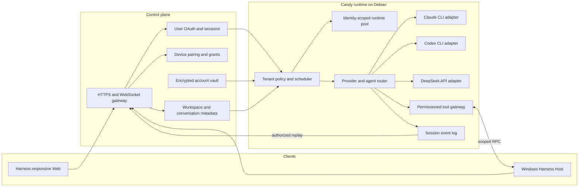

# Agent Note: 多租户 CLI agent 运行时

Status: proposed

[English](2026-09-02-multi-tenant-cli-agent-runtime.md) | 中文

## Problem

Candy 需要通过桌面与手机浏览器以及 Windows Host 服务多个用户，同时在 Debian 服务器上运行 coding agent（编程智能体）。继承的 Harness 提供 agent loop（智能体循环）、插件、会话、响应式 Web 服务、主题与品牌插件以及 Windows 本地文件系统能力，但没有定义租户身份、相互隔离的提供方账户、远程 Windows 所有权或控制平面约定。

产品必须通过 CLI（命令行界面）运行 Claude 和 Codex，并通过 API 运行 DeepSeek。系统可以复用 CLI 安装或 worker 基础设施，但绝不能复用用户凭据、主目录、进程环境、会话、工作区授权或事件流。

## Proposal

保留 Harness agent loop 作为 Candy 的执行核心，并围绕其现有扩展点增加租户感知服务。控制平面负责身份验证、设备所有权、持久元数据、加密凭据和策略。每个 agent 任务在 Debian 上的身份隔离运行时中执行。在 Windows 上运行 Harness Host，并复用其文件系统、目录选择、PowerShell、Git、沙箱、Remote、响应式 Web、主题和品牌 slot 插件。Candy 在这些能力外围增加租户绑定和远程路由，而不替换它们。

桌面与手机浏览器使用相同的 Harness Web 服务。Candy 不交付独立手机应用、UI 框架、调色板或主题选择器。产品身份使用现有品牌 slot，外观继续使用 Harness 主题插件。

此设计不使用 Claude Agent SDK。Claude CLI 和 Codex CLI 是子进程提供方；DeepSeek 是 API 提供方。提供方适配器必须发出统一的生命周期事件，同时保留提供方原生诊断信息。

## Target architecture

控制平面是 `userId`、`deviceId`、`accountId`、工作区授权和会话成员关系的权威来源。Candy 只从通过身份验证的控制平面断言中接受这些值，绝不从客户端选择的请求字段中接受这些值。

运行时池键为 `userId + provider + accountId`。worker 可以共享不可变 CLI 二进制文件、包缓存和调度基础设施。不同池键之间不得共享凭据文件、可写主目录、环境覆盖、进程树、会话存储或工作区挂载。

## Runtime contracts

1. 控制平面为每次运行签发短期且绑定受众的执行断言。Candy 在调度任务前验证签发者、受众、有效期、租户、账户、会话、设备、工作区授权和 nonce。
2. 每次 CLI 调用获得隔离主目录、最小环境、受限工作目录、取消句柄、输出限制和审计上下文。秘密只注入该次调用，不写入共享仓库或事件日志。
3. 提供方适配器统一开始、文本、推理、工具请求、工具结果、用量、完成、取消和失败事件。它保留经过脱敏的提供方原生诊断信息以便排错。
4. Windows 操作要求已配对设备在线，并且授权必须指定工作区和允许的操作类别。配套程序解析规范路径并拒绝越过授权范围的路径遍历。
5. 会话事件仅追加并按租户分区。系统在每次回放、订阅、导出和删除请求中依据会话成员关系授权。
6. 子 agent 继承父运行的账户、工作区、工具、token、时间和并发授权的子集。创建子 agent 不能扩大任何授权。

## Delivery plan

| Task | Outcome | Depends on | Exit evidence |
|---|---|---|---|
| R0 | fork 边界和威胁模型 | 无 | 架构说明获批，滥用场景由测试或具名后续任务覆盖 |
| R1 | 租户、提供方账户、凭据和授权模型 | R0 | 跨租户访问测试快速失败，凭据记录已加密 |
| R2 | DeepSeek API、Claude CLI 和 Codex CLI 适配器 | R1 | 流式传输、取消、错误和用量的约定测试通过 |
| R3 | 多 agent 编排 | R2 | 父子授权、预算、取消和审计测试通过 |
| R4 | Harness Web 和提供方账户配置 | R1, R2 | 桌面与手机浏览器使用同一响应式服务，用户只能管理自己的账户 |
| R5 | Windows Harness Host 租户绑定 | R1, R3 | 已注册 Host 操作复用 Harness 插件并通过租户、路径与权限测试 |
| R6 | 迁移、端到端验证和发布 | R2, R3, R4, R5 | 分阶段发布满足安全、恢复、延迟和回滚门禁 |

### R0 — Boundary and threat model

- [ ] 记录继承的 Harness 能力以及归 Candy 所有的控制平面职责。
- [ ] 建模凭据窃取、租户混淆、路径遍历、事件泄漏、进程逃逸、重放和 confused-deputy 威胁。
- [ ] 定义浏览器、手机客户端、控制平面、Candy 运行时、提供方进程和 Windows 配套程序的信任边界。
- [ ] 为后续任务增加架构决策和滥用场景评审门禁。

### R1 — Tenant and account foundation

- [x] 为用户、设备、提供方账户、工作区授权、对话、会话、运行和子运行定义稳定标识符及 schema([`dsh-control-plane`](../../implemented/architecture/2026-09-02-candy-control-plane-identifiers.zh.md))。
- [x] 实现带版本封装、密钥轮换、脱敏读取、撤销和审计事件的加密凭据存储（[`dsh-credential-vault`](../../implemented/architecture/2026-09-02-candy-credential-vault.zh.md)）；审计记录会被返回，持久化它们的存储仍未构建。
- [x] 实现短期执行断言，并拒绝客户端提供的租户或账户覆盖值（[`dsh-execution-assertion`](../../implemented/architecture/2026-09-02-candy-execution-assertions.zh.md)）；nonce 重放存储仍归调度器所有。
- [x] 按池键隔离运行时主目录、进程所有权、事件日志、包含私有内容的缓存、配额和清理（[`dsh-runtime-pool`](../../implemented/architecture/2026-09-02-candy-runtime-pool-partitioning.zh.md)）；键与每个池的根目录已被推导，而创建目录、放置进程、强制配额与清理仍属于尚未构建的池运行时。

### R2 — Provider adapters

适配器实现的是继承而来的 `dsh-llm` seam，而不是 Candy 自有的 seam。`LlmAdapter` 是提供方基类，`StreamChunk` 已经承载块开始、文本、推理、工具调用增量、用量与一次终止 finish，而 `dsh-llm/invariant` 会在每条提供方流周围强制执行该语法。Candy 只向该 seam 增加提供方，不定义第二套生命周期词汇。

- [x] 实现 DeepSeek API 适配器，覆盖流式传输、工具调用、用量、重试分类、取消和脱敏错误——已作为 `dsh-llm-deepseek`（`DeepSeekAdapter`）继承而来，`dsh-llm-pi-ai` 是同一 seam 的第二个实现。
- [x] 实现 Claude CLI 适配器，具备隔离的 home、非交互输入、结构化输出解析、取消与进程树清理（[`dsh-claude-cli-protocol`](../../implemented/architecture/2026-09-03-claude-cli-stream-protocol.zh.md) 与 [`dsh-llm-claude-cli`](../../implemented/architecture/2026-09-03-claude-cli-llm-adapter.zh.md)）。Candy 自行解析 `--output-format stream-json`，而不复用 `dsh-subagent-claude-code` 所走的 Agent SDK 路径，因为该 SDK 提供的是一个智能体循环，而这条缝隙需要的是一次模型调用。这条路由的窄是决定的结果而非遗漏：它服务一次性文本调用，并逐项具名拒绝对话、工具模式，以及 CLI 没有对应开关的每一个生成控制项。因此智能体循环目前还不能使用它 —— 补上这一点需要适配器笔记中记录为待决的多轮与工具决定。
- [ ] 使用相同的隔离和生命周期保证实现 Codex CLI 适配器。受阻于录制真实输出，而不是受阻于设计。对 `codex` 0.153.0 实测到的事实：`codex exec --json` 把 JSONL 写到 stdout；提示词是位置参数，且必须关闭 stdin，否则命令会一直等它；隔离手段是 `CODEX_HOME` 加上 `--ephemeral`、`--ignore-user-config`、`-s read-only`、`-C <dir>` 与 `--skip-git-repo-check`；没有系统提示词开关，也没有接受调用方工具模式的开关。观察到的帧是 `{"type":"thread.started","thread_id"}`、`{"type":"turn.started"}`、`{"type":"error","message"}` 与 `{"type":"item.completed","item":{"id","type","message"}}` —— 一个 thread/turn/item 模型，与 Claude CLI 的 Messages API 事件不同。内容帧、完成帧与用量帧始终没有到达：本环境的出网策略拒绝 `api.openai.com`，因此任何运行都过不了建连这一步，`developers.openai.com` 同样被封，而 npm 包只分发一个启动器、不含任何 schema。仅凭这些帧名就写出翻译器，正是 Claude CLI 那项工作所避免的猜测 —— 在那里有三处行为与合理假设相反。它需要在一台有出网和密钥的主机上录制一次运行。
- [x] 构建统一的提供方约定测试套件，覆盖成功、畸形输出、超时、配额、取消、崩溃和秘密泄漏 fixture（测试前置数据）（[`dsh-llm-adapter-contract`](../../implemented/architecture/2026-09-03-llm-adapter-conformance.zh.md)）。它跑在缝隙上，因为「恰好一个终止 chunk」的保证属于 `LlmRuntime` 而不属于适配器，且这条缝隙上的每一个适配器都运行它 —— `dsh-llm-deepseek`、`dsh-llm-pi-ai` 与 `dsh-llm-claude-cli`。运行它发现并修复了一个真实的进程泄漏：一个停止读取的消费方会让 CLI 继续运行。超时、配额与崩溃合并为一个失败运行用例，因为套件断言的是适配器面对一次失败该做什么，而不是它由什么引起；畸形输出仍归各适配器自己的线格式解析器。

### R3 — Multi-agent orchestration

- [ ] 为显式选择、能力匹配和允许的回退增加 agent 注册表和路由策略。
- [ ] 增加父子运行记录以及父级子集授权、深度、并发、token、时间和成本预算。深度与授权是继承来的，不是 Candy 要建的：`dsh-subagent` 已经拒绝超过 `maxDepth` 的子运行，并把被委派子运行的沙箱模式与审批策略钉在父运行上。预算这一半已经完成（[`dsh-run-budget`](../../implemented/architecture/2026-09-03-run-budget-delegation.zh.md)）：子运行的 token、挂钟时间、金额与并发在预留时就从父运行扣除，因此超额委派是不可能的，而不是可被发现的；未花完的余额在结算时归还。已耗尽的运行在门口就被拒绝：`admitRun` 通过一个必填的 `findBudget` 端口读取租户预算，在消费 nonce 或打开凭据之前就拒绝（[没有任何人查询过的预算](../../implemented/architecture/2026-09-03-admission-enforces-the-budget.zh.md)）。剩下的是持久运行记录本身 —— 持久化一次运行的剩余额度，以及让未结算的预留过期。
- [ ] 向子运行、提供方进程、工具和事件流传播取消，并验证进程已完全清理。
- [ ] 在租户范围的审计轨迹中记录路由、委派、工具授权、用量和最终状态。已从记录本已存在、却正在丢失的那一处入手：`admitRun` 只在成功时返回保险库的审计，并丢弃了 `openCredential` 在失败分支上产生的记录，丢掉的正是保险库已检测到的跨租户访问尝试。现在每一种准入结果都携带 `audits`（[被拒绝的运行正是审计轨迹的用途所在](../../implemented/architecture/2026-09-03-run-admission-audits-every-outcome.zh.md)）。这个面依然只有保险库的操作那么宽 —— 路由、委派、工具授权、用量与最终状态需要本次发布尚未构建的调度与编排 —— 并且不持久化这些记录；按租户分区的存储仍归调用方。

### R4 — Harness Web and account configuration

- [x] 增加提供方账户列表、创建、验证、默认选择、撤销和删除 API，并执行所有权检查（[`dsh-provider-accounts`](../../implemented/architecture/2026-09-03-provider-account-management.zh.md)）；Web controller 与各提供方验证探测仍未构建。
- [ ] 扩展现有 Harness Web 设置以管理 DeepSeek API 密钥以及服务器端 Claude CLI 和 Codex CLI 登录状态；在桌面和手机视口尺寸下验证相同路由。
- [ ] 复用 Harness 主题和品牌 slot 插件；移除 Candy 专用调色板、主题选择器、重复布局或独立手机界面。
- [ ] 提供安全诊断，但不返回 token、凭据路径、原始环境值或其他租户的元数据。

### R5 — Windows Harness Host tenant binding

- [ ] 把每个 Windows Harness Host 注册到一个用户和设备，并将其现有 Remote 能力绑定到短期 Candy 断言。
- [ ] 在显式工作区根目录和操作类别授权之后，复用 `fs-local`、目录选择、PowerShell、Git、Windows ACL 沙箱和 API Gateway 插件。
- [ ] 增加服务器 URL、配对、连接状态、撤销、离线检测、重连、幂等、输出限制和批准状态，但不定义第二套文件操作协议。
- [ ] 在 Windows 上测试租户路由、Unicode 与长路径、分支发现、并发编辑、设备撤销、重连、junction 或符号链接逃逸和恶意路径输入。

### R6 — Migration and release

- [ ] 增加从 ClauGod 概念到 Candy 的配置和元数据迁移，但不导入 Claude SDK 凭据或会话。
- [ ] 为每个提供方、多租户、多账户、子 agent、Windows 工作区和重连回放运行端到端场景。
- [ ] 在功能开关后发布，并配置按提供方 canary 测试、资源仪表盘、安全告警、备份和经过验证的回滚流程。
- [ ] 仅在迁移验证后移除过时的 Claude SDK 路径，并发布运维和用户恢复指南。

## Alternatives considered

**继续构建自定义 agent loop。** 这种方案保留完整控制权，但会重复建设 Harness 的插件、会话、工具和事件基础。团队需要先花更多时间重建基础设施，之后才能改进租户隔离和提供方支持。

**使用 Claude Agent SDK 作为服务器运行时。** 这种方案让 Claude 成为架构中心，并削弱与 Codex CLI 和 DeepSeek 的对等性。它也与把 Claude 和 Codex 标准化为 CLI 子进程提供方的要求冲突。

**在用户之间共享一个已登录的 CLI 主目录。** 这种方案可以减少登录操作，但会使凭据归属、撤销、审计和数据隔离不可靠。Candy 允许共享不可变安装，但不允许共享已认证状态。

**构建独立手机客户端和 Candy 配色系统。** 这种方案会重复 Harness 的响应式 Web 界面与主题注册表，增加视觉偏移，并形成两条客户端发布路径。Candy 改为组合现有 Web、主题和品牌 slot 插件。

## Acceptance criteria

1. 两个并发租户可以使用相同的提供方和仓库名称，但不共享凭据、可写主目录、进程、会话事件、工作区授权或包含私有内容的缓存。
2. Claude CLI、Codex CLI 和 DeepSeek API 通过同一套生命周期约定测试，包括取消和提供方失败。
3. 子 agent 不能超过父运行的账户、工作区、工具、token、时间或并发授权。
4. 已撤销的账户、设备或工作区授权立即阻止新任务，并防止未经授权的回放或重连。
5. Windows 操作无法逃出显式授权的规范工作区根目录，并且可以归因于一个用户、设备、会话和运行。
6. 桌面与手机浏览器使用相同的响应式 Harness Web 路由，可以重连并回放获授权的会话状态，而不能直接访问提供方凭据。
7. 运维人员可以检测、遏制和审计跨租户尝试、遗留进程、配额违规和提供方故障，而无需读取用户秘密。

## Risks

CLI 输出和身份验证格式可能在没有稳定机器约定的情况下变化。适配器需要版本探测、严格解析器、兼容性 fixture 和快速失败行为。

如果所有 worker 共享一个操作系统身份，子进程隔离会弱于完整的主机边界。经过测量和威胁评审后，生产部署可能需要按租户分配操作系统用户或采用更强沙箱。

Windows RPC 把攻击面扩展到本地文件和命令执行。窄范围授权、敏感类别的本地确认、规范路径检查、签名消息和撤销都是发布阻塞条件。

控制平面与 Candy 的身份或授权语义可能发生偏移。带版本的断言 schema、兼容窗口、约定测试和协调发布必须使两侧保持一致。
